// Please render with Asciidoctor
:doc-id: CTF2-SPECRC-1.0

= **{doc-id}**: Common Trace Format version{nbsp}2 release candidate
Philippe Proulx <pproulx@efficios.com>
v1.0, 25 November 2021
:attribute-missing: warn
:icons: font
:nofooter:
:sectnums:
:sectnumlevels: 5
:toc: left
:toclevels: 3
:nbh: &#8209;
:minus: −
:times: ×
:noteq: ≠
:ieee754: https://standards.ieee.org/standard/754-2008.html[IEEE 754-2008] binary interchange format
:ctf1-nl: CTF{nbsp}1
:ctf1: https://diamon.org/ctf/v1.8.3/[{ctf1-nl}]
:ctf2: CTF{nbsp}2
:fl-ba: fixed-length bit array
:c-fl-ba: Fixed-length bit array
:vl-ba: variable-length bit array
:c-vl-ba: Variable-length bit array
:fl-bool: fixed-length boolean
:c-fl-bool: Fixed-length boolean
:fl-int: fixed-length integer
:c-fl-int: Fixed-length integer
:fl-uint: fixed-length unsigned integer
:c-fl-uint: Fixed-length unsigned integer
:fl-sint: fixed-length signed integer
:c-fl-sint: Fixed-length signed integer
:vl-int: variable-length integer
:c-vl-int: Variable-length integer
:vl-uint: variable-length unsigned integer
:c-vl-uint: Variable-length unsigned integer
:vl-sint: variable-length signed integer
:c-vl-sint: Variable-length signed integer
:fl-enum: fixed-length enumeration
:c-fl-enum: Fixed-length enumeration
:fl-uenum: fixed-length unsigned enumeration
:c-fl-uenum: Fixed-length unsigned enumeration
:fl-senum: fixed-length signed enumeration
:c-fl-senum: Fixed-length signed enumeration
:vl-enum: variable-length enumeration
:c-vl-enum: Variable-length enumeration
:vl-uenum: variable-length unsigned enumeration
:c-vl-uenum: Variable-length unsigned enumeration
:vl-senum: variable-length signed enumeration
:c-vl-senum: Variable-length signed enumeration
:fl-fp: fixed-length floating point number
:c-fl-fp: Fixed-length floating point number
:str: null-terminated string
:c-str: Null-terminated string
:sl-array: static-length array
:c-sl-array: Static-length array
:sl-str: static-length string
:c-sl-str: Static-length string
:dl-array: dynamic-length array
:c-dl-array: Dynamic-length array
:dl-str: dynamic-length string
:c-dl-str: Dynamic-length string
:sl-blob: static-length BLOB
:c-sl-blob: Static-length BLOB
:dl-blob: dynamic-length BLOB
:c-dl-blob: Dynamic-length BLOB
:fl-ba-fc: <<fl-ba-fc,fixed-length bit array field class>>
:c-fl-ba-fc: <<fl-ba-fc,Fixed-length bit array field class>>
:vl-ba-fc: <<vl-ba-fc,variable-length bit array field class>>
:c-vl-ba-fc: <<vl-ba-fc,Variable-length bit array field class>>
:fl-bool-fc: <<fl-bool-fc,fixed-length boolean field class>>
:c-fl-bool-fc: <<fl-bool-fc,Fixed-length boolean field class>>
:fl-int-fc: <<fl-int-fc,fixed-length integer field class>>
:c-fl-int-fc: <<fl-int-fc,Fixed-length integer field class>>
:fl-uint-fc: <<fl-int-fc,fixed-length unsigned integer field class>>
:c-fl-uint-fc: <<fl-int-fc,Fixed-length unsigned integer field class>>
:fl-sint-fc: <<fl-int-fc,fixed-length signed integer field class>>
:c-fl-sint-fc: <<fl-int-fc,Fixed-length signed integer field class>>
:vl-int-fc: <<vl-int-fc,variable-length integer field class>>
:c-vl-int-fc: <<vl-int-fc,Variable-length integer field class>>
:vl-uint-fc: <<vl-int-fc,variable-length unsigned integer field class>>
:c-vl-uint-fc: <<vl-int-fc,Variable-length unsigned integer field class>>
:vl-sint-fc: <<vl-int-fc,variable-length signed integer field class>>
:c-vl-sint-fc: <<vl-int-fc,Variable-length signed integer field class>>
:fl-enum-fc: <<fl-enum-fc,fixed-length enumeration field class>>
:c-fl-enum-fc: <<fl-enum-fc,Fixed-length enumeration field class>>
:fl-uenum-fc: <<fl-enum-fc,fixed-length unsigned enumeration field class>>
:c-fl-uenum-fc: <<fl-enum-fc,Fixed-length unsigned enumeration field class>>
:fl-senum-fc: <<fl-enum-fc,fixed-length signed enumeration field class>>
:c-fl-senum-fc: <<fl-enum-fc,Fixed-length signed enumeration field class>>
:vl-enum-fc: <<vl-enum-fc,variable-length enumeration field class>>
:c-vl-enum-fc: <<vl-enum-fc,Variable-length enumeration field class>>
:vl-uenum-fc: <<vl-enum-fc,variable-length unsigned enumeration field class>>
:c-vl-uenum-fc: <<vl-enum-fc,Variable-length unsigned enumeration field class>>
:vl-senum-fc: <<vl-enum-fc,variable-length signed enumeration field class>>
:c-vl-senum-fc: <<vl-enum-fc,Variable-length signed enumeration field class>>
:fl-fp-fc: <<fl-fp-fc,fixed-length floating point number field class>>
:c-fl-fp-fc: <<fl-fp-fc,Fixed-length floating point number field class>>
:str-fc: <<str-fc,null-terminated string field class>>
:c-str-fc: <<str-fc,Null-terminated string field class>>
:sl-array-fc: <<sl-array-fc,static-length array field class>>
:c-sl-array-fc: <<sl-array-fc,Static-length array field class>>
:sl-str-fc: <<sl-str-fc,static-length string field class>>
:c-sl-str-fc: <<sl-str-fc,Static-length string field class>>
:dl-array-fc: <<dl-array-fc,dynamic-length array field class>>
:c-dl-array-fc: <<dl-array-fc,Dynamic-length array field class>>
:dl-str-fc: <<dl-str-fc,dynamic-length string field class>>
:c-dl-str-fc: <<dl-str-fc,Dynamic-length string field class>>
:sl-blob-fc: <<sl-blob-fc,static-length BLOB field class>>
:c-sl-blob-fc: <<sl-blob-fc,Static-length BLOB field class>>
:dl-blob-fc: <<dl-blob-fc,dynamic-length BLOB field class>>
:c-dl-blob-fc: <<dl-blob-fc,Dynamic-length BLOB field class>>
:struct-fc: <<struct-fc,structure field class>>
:c-struct-fc: <<struct-fc,Structure field class>>
:opt-fc: <<opt-fc,optional field class>>
:c-opt-fc: <<opt-fc,Optional field class>>
:var-fc: <<var-fc,variant field class>>
:c-var-fc: <<var-fc,Variant field class>>
:diamon: https://diamon.org/[DiaMon Workgroup]
:c-bo: https://en.wikipedia.org/wiki/Endianness[Byte order]
:rfc-7464: https://datatracker.ietf.org/doc/html/rfc7464[RFC&#160;7464]
:must: pass:q[__MUST__]
:must-not: pass:q[__MUST&#160;NOT__]
:required: pass:q[__REQUIRED__]
:should: pass:q[__SHOULD__]
:should-not: pass:q[__SHOULD&#160;NOT__]
:may: pass:q[__MAY__]
:optional: pass:q[__OPTIONAL__]
:var-f: pass:q[__**F**__]
:var-o: pass:q[__**O**__]
:var-v: pass:q[__**V**__]
:var-p: pass:q[__**P**__]
:var-s: pass:q[__**S**__]
:var-dec-po: pass:q[__**PO**__]
:var-dec-o: pass:q[__**O**__]
:var-dec-o-minus-po: pass:q[__**O**__&#160;−&#160;__**PO**__]

This document is a release candidate of the Common Trace Format (CTF)
version{nbsp}2 specification (_**CTF2-SPEC-2.0**_).

.RFC 2119
IMPORTANT: The key words {must}, {must-not}, {required},
{should}, {should-not}, {may}, and {optional} in this document, when
emphasized, are to be interpreted as described in
https://www.ietf.org/rfc/rfc2119.txt[RFC{nbsp}2119].

== What's {ctf2}?

The _**Common Trace Format**_ version{nbsp}2 is a binary
https://en.wikipedia.org/wiki/Tracing_(software)[trace] format designed
to be very fast to write without compromising great flexibility.

The intention of {ctf2} is that applications written in any programming
language, and running on any system (be it Linux or bare metal, for
example), can generate traces natively.

A {ctf2} trace has all its <<ds,data streams>> described by a
<<metadata-stream-overview,metadata stream>>. Given the rich set of
supported <<fc,data field types>>, this makes it possible for a {ctf2}
<<producer-def,producer>> to append data structures as is to data
streams without further "`data massaging`". Indeed, the size, alignment,
and byte order of fixed-length fields are all configurable parameters
within the metadata stream.

{ctf2} is transport agnostic: this document doesn't specify how to
transport or store {ctf2} streams. Other documents can specify such
conventions, and conform {ctf2} producers and <<consumer-def,consumers>>
may or may not adhere to them.

{ctf2} is a major revision of {ctf1}, bringing many improvements, such
as:

* Using JSON text sequences for the metadata stream.

* Adding <<aux-stream,auxiliary streams>> (also JSON text sequences).

* Simplifying the metadata stream.

* Adding new <<fc,field classes>>.

* Using <<roles,roles>> instead of reserved structure member names to
  identify "`special`" fields.

and more, while remaining backward compatible at the data stream level.

== Common definitions

Common {ctf2} definitions:

[[byte-def]] <<byte-def,Byte>>::
    A group of eight https://en.wikipedia.org/wiki/Bit[bits] operated on
    as a unit.
+
The bits are indexed such that, if the byte represents an 8-bit unsigned
integer, bit{nbsp}0 is the
https://en.wikipedia.org/wiki/Bit_numbering#Least_significant_bit[least
significant] and bit{nbsp}7 is the
https://en.wikipedia.org/wiki/Bit_numbering#Most_significant_bit[most
significant].

[[class-def]] <<class-def,Class>>::
    A set of values (instances) which share common properties.
+
For example, a {fl-uint-fc} with an 8-bit length property is the set of
the all the {fl-uint} fields from binary `00000000` to `11111111`
(integers 0{nbsp}to{nbsp}255).
+
This specification often states that some class _describes_ instances.
For example, an <<erc-frag,event record class>> describes <<er,event
records>>.

[[consumer-def]] <<consumer-def,Consumer>>::
    A software or hardware system which consumes (reads) the streams of
    a <<trace,trace>>.
+
A trace consumer is often a _trace viewer_ or a _trace analyzer_.

[[ns-def]] <<ns-def,Namespace>>::
    A string of which the purpose is to avoid naming conflicts.
+
This document doesn't specify the format of a namespace. A producer
{should} use a URI, or at least include a domain name owned by the
organization defining the objects under a namespace.
+
IMPORTANT: The `std` namespace is reserved for the {ctf2} specification.

[[producer-def]] <<producer-def,Producer>>::
    A software or hardware system which produces (writes) the streams of
    a <<trace,trace>>.
+
A trace producer is often a _tracer_.

[[seq-def]] <<seq-def,Sequence>>::
    A set of related items which follow each other in a particular
    order.

[[stream-def]] <<stream-def,Stream>>::
    A <<seq-def,sequence>> of <<byte-def,bytes>>.

[[trace]]
== Trace composition

A trace is:

* One <<metadata-stream-overview,metadata stream>>.
* One or more <<data-stream,data streams>>.
* Zero or more <<aux-stream,auxiliary streams>>.

As a reminder, this specification defines a <<stream-def,stream>> as a
sequence of bytes.

NOTE: This document doesn't specify how to transport or store {ctf2}
streams. A <<producer-def,producer>> could serialize all streams as a
single file on the file system, or it could send the streams over the
network using TCP, to name a few examples.

[[metadata-stream-overview]]
=== Metadata stream (overview)

A metadata stream describes trace <<ds,data streams>> with JSON objects.

A metadata stream describes things such as:

* The <<cc-frag,class>> of the data stream <<def-clk,default clocks>>.
* The names of <<erc-frag,event record classes>>.
* The <<fc,classes>> of event record fields.

Multiple traces {may} share the same metadata stream: a given trace
{may} contain specific information in its own <<aux-stream,auxiliary
streams>>.

See <<metadata-stream>> for the full metadata stream specification.

[[ds]]
=== Data stream

A _data stream_ is a <<seq-def,sequence>> of one or more data
<<pkt,packets>>:

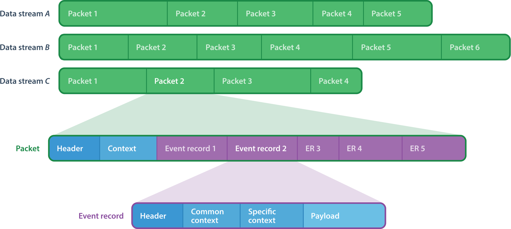

In the <<metadata-stream,metadata stream>>, a
<<dsc-frag,data stream class>> describes data streams.

A packet {must} contain one or more bytes of data.

Although a packet {may} contain padding (garbage data) at the end
itself, from the point of view of a data stream, there's no padding
between packets. In other words, the byte following the last byte of a
packet is the first byte of the next packet.

A data stream {may} have, conceptually:

[[def-clk]] One default, monotonic clock::
    Described by a <<cc-frag,clock class>> in the metadata stream.
+
<<pkt,Packets>> and <<er,event records>> {may} contain snapshots, named
_timestamps_, of the default clock of their data stream.

[[disc-er-counter]] One counter of discarded event records::
    Indicates the number of event records which the
    <<producer-def,producer>> needed to discard for different reasons.
+
For example, a tracer could discard an event record when it doesn't fit
some buffer and there's no other available buffer.
+
A packet {may} contain a snapshot of this counter.

See <<ds-dec>> to learn how to decode a {ctf2} data stream.

[[pkt]]
==== Packet

A _packet_ is a segment of a <<ds,data stream>>.

A packet contains a <<seq-def,sequence>> of data _fields_ or padding
(garbage data). In the metadata stream, <<fc,field classes>> describe
data fields.

A packet {var-p}, contained in a data stream{nbsp}{var-s}, contains,
in this order:

. [[pkt-header]] {optional}: A **header** <<struct-fc,structure>> field,
  described at the <<tc-frag,trace class>> level in the
  <<metadata-stream,metadata stream>>, which contains, in this order:
.. {optional}: A packet magic number field (0xc1fc1fc1, or 3254525889).
.. In any order:
*** {optional}: A trace class UUID field.
*** {optional}: One or more fields which contain the numeric ID of the
    <<dsc-frag,class>> of{nbsp}{var-s}.
*** {optional}: One or more fields which contain the numeric ID
    of{nbsp}{var-s}.

. [[pkt-ctx]] {optional}: A **context** <<struct-fc,structure>> field,
  described at the <<dsc-frag,data stream class>> level in the metadata
  stream, which contains, in any order:
** {optional}: A field which contains the total size of{nbsp}{var-p},
   in bits (always a multiple of 8).
** {optional}: A field which contains the content size of{nbsp}{var-p},
   in bits.
** {optional}: A field which contains the beginning timestamp
   of{nbsp}{var-p}.
** {optional}: A field which contains the end timestamp of{nbsp}{var-p}.
** {optional}: A field which contains a snapshot of the
   <<disc-er-counter,discarded event record counter>> of{nbsp}{var-s} at
   the end of{nbsp}{var-p}.
** {optional}: A field which contains the sequence number
   of{nbsp}{var-p} within{nbsp}{var-s}.
** {optional}: User fields.

. Zero or more <<er,event records>>.

A packet {must} contain one or more bytes of data.

A packet {may} contain padding (garbage data) after its _last_ event
record. The size of this padding is the difference between its total
size and its content size (as found in its <<pkt-ctx,context structure
field>>).

Packets are independent of each other: if one removes a packet from a
data stream, a <<consumer-def,consumer>> can still decode the whole data
stream. This is why:

* Packets {may} contain _snapshots_ of the <<disc-er-counter,discarded
  event record counter>> of their data stream.

* Packets and event records {may} contain _timestamps_ which are
  snapshots of the <<def-clk,default clock>> of their data stream.

If the <<pkt-ctx,packet context>> fields of the packets of a data stream
contain a <<pkt-seq-num-role,packet sequence number>> field, a consumer
can recognize missing packets.

See <<pkt-dec>> to learn how to decode a {ctf2} packet.

[[er]]
==== Event record

An _event record_ is the result of a <<producer-def,producer>> writing a
record with {optional} user data when an event occurs during its
execution.

A <<pkt,packet>> contains zero or more event records.

An <<erc-frag,event record class>> describes the specific parts of event
records.

An event record _**E**_, contained in a <<ds,data stream>>{nbsp}{var-s},
contains, in this order:

. [[er-header]] {optional}: A **header** <<struct-fc,structure>> field,
  described at the <<dsc-frag,data stream class>> level in the metadata
  stream, which contains, in any order:
** {optional}: One or more fields which contain the numeric ID of the
   <<erc-frag,class>> of{nbsp}__**E**__ which has the class
   of{nbsp}{var-s} as its parent.
** {optional}: One or more fields which contain a timestamp or a partial
   timestamp.

. [[er-common-ctx]] {optional}: A **common context**
  <<struct-fc,structure>> field, described at the data stream class
  level in the metadata stream, which contains user fields.

. [[er-spec-ctx]] {optional}: A **specific context**
  <<struct-fc,structure>> field, described at the event record class
  level in the metadata stream, which contains user fields.

. [[er-payload]] {optional}: A **payload** <<struct-fc,structure>> field,
  described at the event record class level in the metadata stream,
  which contains user fields.

An event record {must} contain one or more bits of data.

The <<def-clk,default clock>> timestamp of an event record, that is, the
value of the default clock of its <<ds,data stream>> _after_ its
<<er-header,header field>>, if any, is encoded/decoded {must} be greater
than or equal to the default clock timestamp of the previous event
record, if any, within the _same_ data stream.

See <<er-dec>> to learn how to decode a {ctf2} event record.

[[aux-stream]]
=== Auxiliary stream

An auxiliary stream is a JSON text sequence, as specified by {rfc-7464},
which contains extra, structured information about the trace which
doesn't fit the <<ds,data stream>> model.

Each element of an auxiliary stream is a JSON object which has a single
property:

[horizontal]
Name::
    <<ns-def,Namespace>> of the auxiliary stream.

Value::
    A JSON value.

.Auxiliary stream element with the `my.tracer` namespace.
====
[source,json]
----
{
  "my.tracer": {
    "version": [1, 3, 2],
    "session-name": "amqui"
  }
}
----
====

.Auxiliary stream element of which the value is just `42`.
====
[source,json]
----
{
  "328c7a2d-a959-4f60-bd22-cca74359326f": 42
}
----
====

[[env]]
==== Trace environment

To remain backward compatible with {ctf1}, a trace {may} contain an
auxiliary stream having an element with the `std` namespace which
contains trace environment variables under the `environment` property.

The trace environment variables are a single JSON object where each
property is:

[horizontal]
Name::
    Trace environment variable name.

Value::
    Trace environment variable value (any JSON value).

This document doesn't specify trace environment variable names.

.`std` auxiliary stream element with trace environment variables.
====
[source,json]
----
{
  "std": {
    "environment": {
      "hostname": "amqui",
      "domain": "kernel",
      "sysname": "Linux",
      "kernel_release": "4.12.12-1-ARCH",
      "kernel_version": "#1 SMP PREEMPT Sun Sep 10 09:41:14 CEST 2017",
      "tracer_name": "lttng-modules",
      "tracer_major": 2,
      "tracer_minor": 10,
      "tracer_patchlevel": 0
    }
  }
}
----
====

[[metadata-stream]]
== Metadata stream

A metadata stream is a JSON text sequence, as specified by {rfc-7464},
of _fragments_.

Together, the fragments of a metadata stream contain all the information
about the <<ds,data streams>> of one or more <<trace,traces>>.

[[frag]] A _fragment_ is a JSON object; its allowed properties depend on
its `type` property.

.Common properties of a fragment {var-f}.
[%header%autowidth,cols="d,d,a,d,d"]
|===
|Name |Type |Description |Required? |Default

|`type`
|JSON string
|Type of{nbsp}{var-f}.

The value of this property {must} be one of:

`"preamble"`::
    {var-f} is a <<preamble-frag,preamble fragment>>.

`"trace-class"`::
    {var-f} is a <<tc-frag,trace class fragment>>.

`"clock-class"`::
    {var-f} is a <<cc-frag,clock class fragment>>.

`"data-stream-class"`::
    {var-f} is a <<dsc-frag,data stream class fragment>>.

`"event-record-class"`::
    {var-f} is a <<erc-frag,event record class fragment>>.
|Yes
|

|`user-attributes`
|<<user-attrs,User attributes>>
|User attributes of{nbsp}{var-f}.
|No
|`+{}+`

|`extensions`
|<<ext,Extensions>>
|Extensions of{nbsp}{var-f}.

For any fragment except a <<preamble-frag,preamble fragment>>, any
extension which exists under this property {must} also be declared in
the preamble fragment of the same metadata stream.
|No
|`+{}+`
|===

The metadata stream is a JSON text sequence of fragments instead of a
single JSON object containing nested objects to enable real-time, or
"`live`", tracing: a <<consumer-def,consumer>> can always decode
<<er,event records>> having known <<erc-frag,event record classes>>
while a <<producer-def,producer>> can always add new event record
classes to a <<dsc-frag,data stream class>> by appending additional
fragments to the metadata stream. Once a producer appends a fragment to
a metadata stream, the fragment is considered "`frozen`", in that it
never needs to change.

A metadata stream:

* {must} start with a preamble fragment.
* {must} contain exactly one <<preamble-frag,preamble fragment>>.
* {may} contain one <<tc-frag,trace class fragment>>.
* {must} contain one or more <<dsc-frag,data stream class fragments>>
  which {must} follow the trace class fragment, if any.
* {may} contain one or more <<er-frag,event record class fragments>>
  which {must} follow their parent data stream class, if any.

.Partial metadata stream.
====
In the sample below, the string `<RS>` represents a single record
separator character (U+001E) and the string `[pass:[...]]` represents
continuation.
----
<RS>{
  "type": "preamble",
  "version": 2
}
<RS>[...]
----
====

[NOTE]
====
This section doesn't specify how a metadata stream translates into
<<ds,data stream>> encoding and decoding rules; it only describes
objects and their properties.

See <<ds-dec>> to learn how to decode a data stream.
====

[[uuid]]
=== UUID

Both a <<tc-frag,trace class fragment>> and a <<cc-frag,clock class
fragment>> {may} have a
https://en.wikipedia.org/wiki/Universally_unique_identifier[_UUID_]
property.

Within a metadata stream, a UUID is a JSON array of 16{nbsp}JSON
integers which are the numeric values of the 16{nbsp}bytes of the
UUID.

.`e53e0ab8-50a1-4f0a-b710-b5f0bba9c4ac` UUID.
====
[source,json]
----
[229, 62, 10, 184, 80, 161, 79, 10, 183, 16, 181, 240, 187, 169, 196, 172]
----
====

[[ext]]
=== Extensions

A <<producer-def,producer>> {may} add _extensions_ to many metadata
stream JSON objects.

The purpose of an extension is to add core features to {ctf2} or to
modify existing core features, as specified by this document. In other
words, an extension {may} **alter** the format itself.

This document doesn't specify what an extension exactly is.

The <<preamble-frag,preamble fragment>> of the metadata stream contains
_extension declarations_:

* Any extension in metadata stream objects {must} be declared, by
  namespace and name, in the preamble fragment.
+
Declaring an extension is said to _enable_ it.

* If a <<consumer-def,consumer>> doesn't support _any_ declared
  extension, it {must-not} consume the <<ds,data streams>> of the
  <<trace,trace>>.
+
The consumer {should} report unsupported extensions as an error.

Extensions are a single JSON object, where each property is:

[horizontal]
Name::
    A <<ns-def,namespace>>

Value::
    A <<ns-exts-obj,namespaced extensions object>>

[[ns-exts-obj]] A _namespaced extensions object_ is a JSON object, where
each property is:

[horizontal]
Name::
    An extension name

Value::
    A JSON value

The metadata stream JSON objects which {may} contain extensions as their
`extensions` property are:

* Any <<frag,fragment>>.
+
An extension in the <<preamble-frag,preamble fragment>> also makes it
_declared_/_enabled_.

* Any <<fc,field class>>.

* A <<struct-member-cls,structure field member class>>.

* A <<var-fc-opt,variant field class option>>.

.Three extensions under two namespaces.
====
[source,json]
----
{
  "my.tracer": {
    "piano": {
      "keys": 88,
      "temperament": "equal"
    },
    "ramen": 23
  },
  "abc/xyz": {
    "sax": {
      "variant": "alto"
    }
  }
}
----
====

[[user-attrs]]
=== User attributes

A <<producer-def,producer>> {may} add custom _user attributes_ to many
metadata stream JSON objects.

This document doesn't specify what a user attribute exactly is.

Unlike <<ext,extensions>>, a <<consumer-def,consumer>> {must-not}
consider user attributes to decode <<ds,data streams>>.

User attributes are a single JSON object, where each property is:

[horizontal]
Name::
    A <<ns-def,namespace>>

Value::
    A JSON value

The metadata stream JSON objects which {may} contain user attributes
as their `user-attributes` property are:

* Any <<frag,fragment>>.
* Any <<fc,field class>>.
* A <<struct-member-cls,structure field member class>>.
* A <<var-fc-opt,variant field class option>>.

.User attributes under two namespaces.
====
[source,json]
----
{
  "my.tracer": {
    "max-count": 45,
    "module": "sys"
  },
  "abc/xyz": true
}
----
====

[[fc]]
=== Field classes

A _field class_ describes fields, that is, <<seq-def,sequences>> of bits
as found in a <<ds,data stream>>.

A field class contains all the properties a <<consumer-def,consumer>>
needs to <<ds-dec,decode>> a given field.

A _field_ is a field class instance.

This document specifies the following types of field classes:

Abstract field classes::
    One cannot use the following field classes directly: they are bases
    for other, concrete field classes:
+
* <<int-fc,Abstract integer field class>>
* <<enum-fc,Abstract enumeration field class>>
* <<array-fc,Abstract array field class>>
* <<blob-fc,Abstract BLOB field class>>

Fixed/static-length field classes::
+
* {c-fl-ba-fc}
* {c-fl-bool-fc}
* {c-fl-int-fc}
* {c-fl-enum-fc}
* {c-fl-fp-fc}
* {c-sl-str-fc}
* {c-sl-blob-fc}

Variable/dynamic-length field classes::
+
* {c-vl-ba-fc}
* {c-vl-int-fc}
* {c-vl-enum-fc}
* {c-str-fc}
* {c-dl-str-fc}
* {c-dl-blob-fc}

Compound field classes::
    The following field classes contain one or more field classes.
+
* {c-struct-fc}
* {c-sl-array-fc}
* {c-dl-array-fc}
* {c-opt-fc}
* {c-var-fc}

A field class is a JSON object; its properties depend on its `type`
property.

.Common properties of a field class {var-f}.
[%header%autowidth, cols="d,d,a,d,d"]
|===
|Name |Type |Description |Required? |Default

|`type`
|JSON string
|Type of{nbsp}{var-f}.

The value of this property {must} be one of:

`"fixed-length-bit-array"`::
    {var-f} is a {fl-ba-fc}.

`"fixed-length-boolean"`::
    {var-f} is a {fl-bool-fc}.

`"fixed-length-unsigned-integer"`::
`"fixed-length-signed-integer"`::
    {var-f} is a {fl-int-fc}.

`"fixed-length-unsigned-enumeration"`::
`"fixed-length-signed-enumeration"`::
    {var-f} is a {fl-enum-fc}.

`"fixed-length-floating-point-number"`::
    {var-f} is a {fl-fp-fc}.

`"variable-length-bit-array"`::
    {var-f} is a {vl-ba-fc}.

`"variable-length-unsigned-integer"`::
`"variable-length-signed-integer"`::
    {var-f} is a {vl-int-fc}.

`"variable-length-unsigned-enumeration"`::
`"variable-length-signed-enumeration"`::
    {var-f} is a {vl-enum-fc}.

`"null-terminated-string"`::
    {var-f} is a {str-fc}.

`"static-length-string"`::
    {var-f} is a {sl-str-fc}.

`"static-length-blob"`::
    {var-f} is a {sl-blob-fc}.

`"dynamic-length-string"`::
    {var-f} is a {dl-str-fc}.

`"dynamic-length-blob"`::
    {var-f} is a {dl-blob-fc}.

`"structure"`::
    {var-f} is a {struct-fc}.

`"static-length-array"`::
    {var-f} is a {sl-array-fc}.

`"dynamic-length-array"`::
    {var-f} is a {dl-array-fc}.

`"optional"`::
    {var-f} is a {opt-fc}.

`"variant"`::
    {var-f} is a {var-fc}.
|Yes
|

|`roles`
|<<roles,Roles>>
|Roles of an instance of{nbsp}{var-f}.

See <<tc-frag>> and <<dsc-frag>> which indicate accepted roles for their
root field classes.
|No
|`+[]+`

|`user-attributes`
|<<user-attrs,User attributes>>
|User attributes of{nbsp}{var-f}.
|No
|`+{}+`

|`extensions`
|<<ext,Extensions>>
|Extensions of{nbsp}{var-f}.

Any extension which exists under this property {must} also be declared
in the <<preamble-frag,preamble fragment>> of the metadata stream.
|No
|`+{}+`
|===

The following <<frag,fragment>> properties {must} have a {struct-fc} as
their value:

<<tc-frag,Trace class fragment>>::
    `packet-header-field-class`

<<dsc-frag,Data stream class fragment>>::
+
* `packet-context-field-class`
* `event-record-header-field-class`
* `event-record-common-context-field-class`

<<erc-frag,Event record class fragment>>::
+
* `specific-context-field-class`
* `payload-field-class`

[[field-loc]]
==== Field location

A _field location_ is a means for a <<consumer-def,consumer>> to find a
field which it needs to decode another field.

A consumer needs to find another field to decode instances of the
following <<fc,classes>>:

{c-dl-array-fc}::
{c-dl-str-fc}::
{c-dl-blob-fc}::
    Needs a <<fl-int-fc,{fl-uint}>> or
    <<vl-int-fc,{vl-uint}>> length field.

{c-opt-fc}::
    Needs a <<fl-bool-fc,{fl-bool}>>, <<fl-int-fc,{fl-int}>>, or
    <<vl-int-fc,{vl-int}>> selector field.

{c-var-fc}::
    Needs a <<fl-int-fc,{fl-int}>> or <<vl-int-fc,{vl-int}>> selector
    field.

A field location is a JSON array, where, in this order:

. The first element is the name (JSON string) of a root field from
  where to start the lookup, amongst:
+
[horizontal]
`"packet-header"`:::
    <<pkt-header,Packet header>>
`"packet-context"`:::
    <<pkt-ctx,Packet context>>
`"event-record-header"`:::
    <<er-header,Event record header>>
`"event-record-common-context"`:::
    <<er-common-ctx,Event record common context>>
`"event-record-specific-context"`:::
    <<er-spec-ctx,Event record specific context>>
`"event-record-payload"`:::
    <<er-payload,Event record payload>>

. The following elements are <<struct-fc,structure>> field member names
  (JSON strings) to follow to find the target field.

The length of a field location {must} be greater than or equal to two.

Let _**T**_ be a field which a consumer needs to decode another
field{nbsp}{var-s}:

* If {var-s} is in a packet header, then{nbsp}__**T**__ {must} be in the
  _same_ packet header.

* If {var-s} is in a packet context, then{nbsp}__**T**__ {must} be in
  one of:
** The packet header the _same_ packet.
** The _same_ packet context.

* If {var-s} is in an event record header, then{nbsp}__**T**__ {must}
  be in one of:
** The packet header of the _same_ packet.
** The packet context of the _same_ packet.
** The _same_ event record header.

* If {var-s} is in an event record common context, then{nbsp}__**T**__
  {must} be in one of:
** The packet header of the _same_ packet.
** The packet context of the _same_ packet.
** The event record header of the _same_ event record.
** The _same_ event record common context.

* If {var-s} is in an event record specific context, then{nbsp}__**T**__
  {must} be in one of:
** The packet header of the _same_ packet.
** The packet context of the _same_ packet.
** The event record header of the _same_ event record.
** The event record common context of the _same_ event record.
** The _same_ event record specific context.

* If {var-s} is in an event record payload, then{nbsp}__**T**__ {must}
  be in one of:
** The packet header of the _same_ packet.
** The packet context of the _same_ packet.
** The event record header of the _same_ event record.
** The event record common context of the _same_ event record.
** The event record common specific of the _same_ event record.
** The _same_ event record payload.

* If {var-s} and _**T**_ are _not_ in the same root field,
  then{nbsp}__**T**__ {must-not} be in any <<array-fc,array>> or
  <<opt-fc,optional>> field.

* If {var-s} and _**T**_ are in the same root field, then:
** If {var-s} is in an array field, then{nbsp}__**T**__ {must} be in the
   _same_ array field element as{nbsp}{var-s}.
** If {var-s} is in an optional field, then{nbsp}__**T**__ {must} be in
   the _same_ optional field as{nbsp}{var-s}.

If any structure member name{nbsp}__**N**__ of a field
location{nbsp}__**L**__ names a <<var-fc,variant field>>, then:

If _**N**_ is _not_ the last element of{nbsp}__**L**__::
    The variant field {must} select a structure field, from which the
    lookup process can continue, recursively.

If _**N**_ is the last element of{nbsp}__**L**__::
    The variant field {must} select the target field
    (<<fl-int-fc,{fl-int}>>, <<vl-int-fc,{vl-int}>>, or
    <<fl-bool-fc,{fl-bool}>>), recursively.

In both cases, _all_ the options of the variant field class {must} make
it possible for the lookup process to continue.

.<<dl-array,{c-dl-array}>> field and its length field in the same root field.
====
Assume the following JSON object is an event record payload {struct-fc}.

[source,json]
----
{
  "type": "structure",
  "members": [
    {
      "name": "corn", <3>
      "field-class": {
        "type": "fixed-length-unsigned-integer",
        "length": 32,
        "byte-order": "little-endian"
      }
    },
    {
      "name": "inside",
      "field-class": {
        "type": "fixed-length-unsigned-integer",
        "length": 16,
        "byte-order": "little-endian"
      }
    },
    {
      "name": "carbon",
      "field-class": {
        "type": "dynamic-length-array", <1>
        "length-field-location": ["event-record-payload", "corn"], <2>
        "element-field-class": {
          "type": "null-terminated-string"
        }
      }
    }
  ]
}
----
<1> {c-dl-array-fc}.
<2> Length field location of the {dl-array-fc}.
<3> Length member class.
====

.{c-dl-array} field and its length field in the same root field, within the same array field element.
====
Assume the following JSON object is an event record payload {struct-fc}.

Both the {dl-array} field and its length field exist within the same
element of the <<sl-array-fc,{sl-array}>> field named `nature`.

[source,json]
----
{
  "type": "structure",
  "members": [
    {
      "name": "norm",
      "field-class": {
        "type": "null-terminated-string"
      }
    },
    {
      "name": "nature",
      "field-class": {
        "type": "static-length-array",
        "length": 43,
        "element-field-class": {
          "type": "structure",
          "members": [
            {
              "name": "laser", <3>
              "field-class": {
                "type": "variable-length-unsigned-integer"
              }
            },
            {
              "name": "joystick",
              "field-class": {
                "type": "dynamic-length-array", <1>
                "length-field-location": [ <2>
                  "event-record-payload",
                  "nature",
                  "laser"
                ],
                "element-field-class": {
                  "type": "null-terminated-string"
                }
              }
            }
          ]
        }
      }
    }
  ]
}
----
<1> {c-dl-array-fc}.
<2> Length field location of the {dl-array-fc}.
<3> Length member class.
====

.{c-dl-array} and its length field in the same root field, within the same <<var-fc,variant>> field.
====
Assume the following JSON object is an event record payload {struct-fc}.

Both the {dl-array} field and its length field exist within the same
option of the <<var-fc,variant>> field named `clinic`.

Moreover, the selector field of the `clinic` variant field is the
`lawyer` field.

[source,json]
----
{
  "type": "structure",
  "members": [
    {
      "name": "lawyer", <5>
      "field-class": {
        "type": "fixed-length-signed-integer",
        "length": 16,
        "byte-order": "little-endian"
      }
    },
    {
      "name": "clinic",
      "field-class": {
        "type": "variant",
        "selector-field-location": ["event-record-payload", "lawyer"], <4>
        "options": [
          {
            "selector-field-ranges": [[0, 0]],
            "field-class": {
              "type": "null-terminated-string"
            }
          },
          {
            "selector-field-ranges": [[1, 4]],
            "field-class": {
              "type": "structure",
              "members": [
                {
                  "name": "lemon", <3>
                  "field-class": {
                    "type": "fixed-length-unsigned-integer",
                    "length": 8,
                    "byte-order": "big-endian"
                  }
                },
                {
                  "name": "joystick",
                  "field-class": {
                    "type": "dynamic-length-array", <1>
                    "length-field-location": [ <2>
                      "event-record-payload",
                      "clinic",
                      "lemon"
                    ],
                    "element-field-class": {
                      "type": "null-terminated-string"
                    }
                  }
                }
              ]
            }
          },
          {
            "selector-field-ranges": [[5, 5], [7, 7]],
            "field-class": {
              "type": "fixed-length-boolean",
              "length": 8,
              "byte-order": "little-endian"
            }
          }
        ]
      }
    }
  ]
}
----
<1> {c-dl-array-fc}.
<2> Length field location of the {dl-array-fc}.
<3> Length member class.
<4> Selector field location of the variant field class.
<5> Selector member class.
====

.{c-dl-array} and its length field in the same root field; length field is a variant field.
====
Assume the following JSON object is an event record payload {struct-fc}.

The length field of the {dl-array} field is a variant field: it can be
an 8-bit, a 16-bit, or a 32-bit <<fl-int-fc,{fl-int}>> field, depending
on the selection of the variant field.

Moreover, the selector field of the variant field is located in another
root field (event record specific context).

[source,json]
----
{
  "type": "structure",
  "members": [
    {
      "name": "glass", <3>
      "field-class": {
        "type": "variant",
        "selector-field-location": ["event-record-specific-context", "sel"],
        "options": [
          {
            "selector-field-ranges": [[0, 0]],
            "field-class": {
              "type": "fixed-length-unsigned-integer", <4>
              "length": 8,
              "byte-order": "little-endian"
            }
          },
          {
            "selector-field-ranges": [[1, 1]],
            "field-class": {
              "type": "fixed-length-unsigned-integer", <4>
              "length": 16,
              "byte-order": "little-endian"
            }
          },
          {
            "selector-field-ranges": [[2, 2]],
            "field-class": {
              "type": "fixed-length-unsigned-integer", <4>
              "length": 32,
              "byte-order": "little-endian"
            }
          }
        ]
      }
    },
    {
      "name": "margin",
      "field-class": {
        "type": "dynamic-length-array", <1>
        "length-field-location": ["event-record-payload", "glass"], <2>
        "element-field-class": {
          "type": "null-terminated-string"
        }
      }
    }
  ]
}
----
<1> {c-dl-array-fc}.
<2> Length field location of the {dl-array-fc}.
<3> Length member class.
<4> Possible length field class.
====

.{c-dl-array} and its length field in the same root field; structure field containing length field is a variant field.
====
Assume the following JSON object is an event record payload {struct-fc}.

The length field of the {dl-array} field is within a structure field
which is a variant field.

Moreover:

* The selector field of the variant field is located in another root
  field (event record common context).

* The field class of the third option of the `glass` variant field class
  contains a {dl-blob-fc} (`lock` member); the
  length field of its instance is the previous member (`eagle`) within
  the same structure field.

[source,json]
----
{
  "type": "structure",
  "members": [
    {
      "name": "glass",
      "field-class": {
        "type": "variant",
        "selector-field-location": ["event-record-common-context", "sel"],
        "options": [
          {
            "selector-field-ranges": [[0, 0]],
            "field-class": {
              "type": "structure",
              "members": [
                {
                  "name": "eagle",
                  "field-class": {
                    "type": "fixed-length-unsigned-integer", <3>
                    "length": 16,
                    "byte-order": "little-endian"
                  }
                },
                {
                  "name": "road",
                  "field-class": {
                    "type": "null-terminated-string"
                  }
                }
              ]
            }
          },
          {
            "selector-field-ranges": [[32, 172]],
            "field-class": {
              "type": "structure",
              "members": [
                {
                  "name": "nuance",
                  "field-class": {
                    "type": "null-terminated-string"
                  }
                },
                {
                  "name": "eagle",
                  "field-class": {
                    "type": "fixed-length-unsigned-integer", <3>
                    "length": 24,
                    "byte-order": "big-endian"
                  }
                }
              ]
            }
          },
          {
            "selector-field-ranges": [[5, 5]],
            "field-class": {
              "type": "structure",
              "members": [
                {
                  "name": "eagle", <5>
                  "field-class": {
                    "type": "variable-length-unsigned-integer" <3>
                  }
                },
                {
                  "name": "lock",
                  "field-class": {
                    "type": "dynamic-length-blob",
                    "length-field-location": [ <4>
                      "event-record-payload",
                      "glass",
                      "eagle"
                    ]
                  }
                }
              ]
            }
          }
        ]
      }
    },
    {
      "name": "margin",
      "field-class": {
        "type": "dynamic-length-array", <1>
        "length-field-location": [ <2>
          "event-record-payload",
          "glass",
          "eagle"
        ],
        "element-field-class": {
          "type": "null-terminated-string"
        }
      }
    }
  ]
}
----
<1> {c-dl-array-fc}.
<2> Length field location of the {dl-array-fc}.
<3> Possible length field class.
<4> Length field location of the {dl-blob-fc}.
<5> Length field class for the {dl-blob-fc}.

Note that both the {dl-array} and {dl-blob} field classes have the same
length field location.
====

.{c-dl-array} and its length field in another root field.
====
Assume the following JSON objects are the event record specific context
and payload <<struct-fc,structure field classes>> of the same
<<erc-frag,event record class>>.

The length field of the {dl-array} field of the event record payload is
within the event record specific context.

.Event record specific context field class.
[source,json]
----
{
  "type": "structure",
  "members": [
    {
      "name": "cook",
      "field-class": {
        "type": "fixed-length-floating-point-number",
        "length": 64,
        "byte-order": "little-endian"
      }
    },
    {
      "name": "vegetable", <1>
      "field-class": {
        "type": "variable-length-unsigned-integer"
      }
    }
  ]
}
----
<1> Length member class.

.Event record payload field class.
[source,json]
----
{
  "type": "structure",
  "members": [
    {
      "name": "avenue",
      "field-class": {
        "type": "dynamic-length-array", <1>
        "length-field-location": [ <2>
          "event-record-specific-context",
          "vegetable"
        ],
        "element-field-class": {
          "type": "null-terminated-string"
        }
      }
    },
    {
      "name": "railroad",
      "field-class": {
        "type": "null-terminated-string"
      }
    }
  ]
}
----
<1> {c-dl-array-fc}.
<2> Length field location of the {dl-array-fc}.
====

[[int-range-set]]
==== Integer range set

An _integer range set_ is a JSON array of integer ranges.

An integer range set {must} contain one or more integer ranges.

An _integer range_ is a JSON array of two elements:

. The lower bound of the range (JSON integer, included).
. The upper bound of the range (JSON integer, included).

An integer range represents all the integer values from the lower bound
of the range to its upper bound.

The upper bound of an integer range {must} be greater than or equal to
its lower bound.

If both the lower and upper bounds of an integer range are equal, then
the integer range represents a single integer value.

.Integer ranges.
====
[source,json]
----
[3, 67]
----

[source,json]
----
[-45, 101]
----

.Single integer value.
[source,json]
----
[42, 42]
----
====

.Integer range set containing three integer ranges.
====
[source,json]
----
[[3, 67], [-45, 1], [42, 42]]
----
====

[[roles]]
==== Roles

Some <<fc,field class>> instances can have _roles_.

A role is specific semantics attached to the fields (instances) of a
field class. For example, the `packet-magic-number` role of a
{fl-int-fc} indicates that the value of its instances {must} be the
<<pkt,packet>> magic number (0xc1fc1fc1).

Roles are a JSON array of role names (JSON strings).

See <<tc-frag>> and <<dsc-frag>> which indicate accepted roles for their
root field classes.

[[fl-ba-fc]]
==== {c-fl-ba} field class

A _{fl-ba}_ field class describes _{fl-ba}_ fields.

A {fl-ba} field is a simple array of contiguous bits, without any
attached integer type semantics.

The length, or number of bits, of a {fl-ba} field is a property
(`length`) of its class.

A {fl-ba} field class acts as a base of a {fl-bool-fc}, a {fl-int-fc},
and a {fl-fp-fc}.

.Common properties of a {fl-ba} field class {var-f}.
[%header%autowidth, cols="d,d,a,d,d"]
|===
|Name |Type |Description |Required? |Default

|`type`
|JSON string
|Type of{nbsp}{var-f}.

The value of this property {must} be `"fixed-length-bit-array"`.
|Yes
|

|`length`
|JSON integer
|Number of bits of an instance of{nbsp}{var-f}.

The value of this property {must} be greater than zero.
|Yes
|

|`byte-order`
|JSON string
|{c-bo} of an instance of{nbsp}{var-f}.

The value of this property {must} be one of:

`"big-endian"`::
    Big-endian.

`"little-endian"`::
    Little-endian.
|Yes
|

|`alignment`
|JSON integer
|Alignment of the first bit of an instance of{nbsp}{var-f}
relative to the beginning of the <<pkt,packet>> which
contains this instance.

The value of this property {must} be a positive power of two.
|No
|`1`

|`roles`
|<<roles,Roles>>
|Roles of an instance of{nbsp}{var-f}.

See <<tc-frag>> and <<dsc-frag>> which indicate accepted roles for their
root field classes.
|No
|`+[]+`

|`user-attributes`
|<<user-attrs,User attributes>>
|User attributes of{nbsp}{var-f}.
|No
|`+{}+`

|`extensions`
|<<ext,Extensions>>
|Extensions of{nbsp}{var-f}.

Any extension which exists under this property {must} also be declared
in the <<preamble-frag,preamble fragment>> of the metadata stream.
|No
|`+{}+`
|===

.Minimal {fl-ba} field class.
====
[source,json]
----
{
  "type": "fixed-length-bit-array",
  "length": 16,
  "byte-order": "little-endian"
}
----
====

.{c-fl-ba} field class with instances aligned to 32{nbsp}bits.
====
[source,json]
----
{
  "type": "fixed-length-bit-array",
  "length": 48,
  "byte-order": "big-endian",
  "alignment": 32
}
----
====

.{c-fl-ba} field class with <<user-attrs,user attributes>>.
====
[source,json]
----
{
  "type": "fixed-length-bit-array",
  "length": 16,
  "byte-order": "little-endian",
  "user-attributes": {
    "my.tracer": {
      "is-nice": true
    }
  }
}
----
====

[[fl-bool-fc]]
==== {c-fl-bool} field class

A _{fl-bool}_ field class is a {fl-ba-fc} which describes _{fl-bool}_
fields.

A {fl-bool} field is a {fl-ba} field which has the following semantics:

If all the bits of the bit array field are cleared (zero)::
    The value of the {fl-bool} field is _false_.

Otherwise::
    The value of the {fl-bool} field is _true_.

.Properties of a {fl-bool} field class {var-f}.
[%header%autowidth, cols="d,d,a,d,d"]
|===
|Name |Type |Description |Required? |Default

|`type`
|JSON string
|Type of{nbsp}{var-f}.

The value of this property {must} be `"fixed-length-boolean"`.
|Yes
|

|`length`
|JSON integer
|Number of bits of an instance of{nbsp}{var-f}.

The value of this property {must} be greater than zero.

Property inherited from the {fl-ba-fc}.
|Yes
|

|`byte-order`
|JSON string
|{c-bo} of an instance
of{nbsp}{var-f}.

The value of this property {must} be one of:

`"big-endian"`::
    Big-endian.

`"little-endian"`::
    Little-endian.

Property inherited from the {fl-ba-fc}.
|Yes
|

|`alignment`
|JSON integer
|Alignment of the first bit of an instance of{nbsp}{var-f}
relative to the beginning of the <<pkt,packet>> which
contains this instance.

The value of this property {must} be a positive power of two.

Property inherited from the {fl-ba-fc}.
|No
|`1`

|`roles`
|<<roles,Roles>>
|Roles of an instance of{nbsp}{var-f}.

See <<tc-frag>> and <<dsc-frag>> which indicate accepted roles for their
root field classes.
|No
|`+[]+`

|`user-attributes`
|<<user-attrs,User attributes>>
|User attributes of{nbsp}{var-f}.
|No
|`+{}+`

|`extensions`
|<<ext,Extensions>>
|Extensions of{nbsp}{var-f}.

Any extension which exists under this property {must} also be declared
in the <<preamble-frag,preamble fragment>> of the metadata stream.
|No
|`+{}+`
|===

.Minimal {fl-bool} field class.
====
[source,json]
----
{
  "type": "fixed-length-boolean",
  "length": 16,
  "byte-order": "little-endian"
}
----
====

.{c-fl-bool} field class with instances aligned to 32{nbsp}bits.
====
[source,json]
----
{
  "type": "fixed-length-boolean",
  "length": 48,
  "byte-order": "big-endian",
  "alignment": 32
}
----
====

.{c-fl-bool} field class with <<user-attrs,user attributes>>.
====
[source,json]
----
{
  "type": "fixed-length-boolean",
  "length": 16,
  "byte-order": "little-endian",
  "user-attributes": {
    "my.tracer": {
      "is-nice": true
    }
  }
}
----
====

[[int-fc]]
==== Abstract integer field class

An _abstract integer_ field class is a base of a {fl-int-fc} and a
{vl-int-fc}.

This field class is abstract in that it only exists to show the relation
between different integer field classes in this document: a
<<pkt,packet>> cannot contain an abstract integer field.

.Common property of an integer field class {var-f}.
[%header%autowidth, cols="d,d,a,d,d"]
|===
|Name |Type |Description |Required? |Default

|`preferred-display-base`
|JSON integer
|Preferred base to display the value of an instance of{nbsp}{var-f}.

The value of this property {must} be one of:

[horizontal]
`2`::
    Binary base.

`8`::
    Octal base.

`10`::
    Decimal base.

`16`::
    Hexadecimal base.

This property exists to remain backward compatible with {ctf1}:
it's not strictly needed to decode an instance of{nbsp}{var-f}.
|No
|`10`
|===

[[fl-int-fc]]
==== {c-fl-int} field class

A _{fl-int}_ field class is both an <<int-fc,abstract integer field
class>> and a {fl-ba-fc} which describes _{fl-int}_ fields.

A {fl-int} field is a {fl-ba} field which has integer semantics.

If the value of the `type` property of a {fl-int} is
`"fixed-length-signed-integer"`, then its instances have the two's
complement format.

A {fl-int} field class acts as a base of a {fl-enum-fc}.

.Common properties of a {fl-int} field class {var-f}.
[%header%autowidth, cols="d,d,a,d,d"]
|===
|Name |Type |Description |Required? |Default

|`type`
|JSON string
|Type of{nbsp}{var-f}.

The value of this property {must} be one of:

`"fixed-length-unsigned-integer"`::
    The instances of{nbsp}{var-f} are {fl-uint} fields.

`"fixed-length-signed-integer"`::
    The instances of{nbsp}{var-f} are {fl-sint} fields.
|Yes
|

|`length`
|JSON integer
|Number of bits of an instance of{nbsp}{var-f}.

The value of this property {must} be greater than zero.

Property inherited from the {fl-ba-fc}.
|Yes
|

|`byte-order`
|JSON string
|{c-bo} of an instance
of{nbsp}{var-f}.

The value of this property {must} be one of:

`"big-endian"`::
    Big-endian.

`"little-endian"`::
    Little-endian.

Property inherited from the {fl-ba-fc}.
|Yes
|

|`alignment`
|JSON integer
|Alignment of the first bit of an instance of{nbsp}{var-f}
relative to the beginning of the <<pkt,packet>> which
contains this instance.

The value of this property {must} be a positive power of two.

Property inherited from the {fl-ba-fc}.
|No
|`1`

|`preferred-display-base`
|JSON integer
|Preferred base to display the value of an instance of{nbsp}{var-f}.

The value of this property {must} be one of:

[horizontal]
`2`::
    Binary base.

`8`::
    Octal base.

`10`::
    Decimal base.

`16`::
    Hexadecimal base.

This property exists to remain backward compatible with {ctf1}:
it's not strictly needed to decode an instance of{nbsp}{var-f}.

Property inherited from the <<int-fc,abstract integer field class>>.
|No
|`10`

|`roles`
|<<roles,Roles>>
|Roles of an instance of{nbsp}{var-f}.

See <<tc-frag>> and <<dsc-frag>> which indicate accepted roles for their
root field classes.
|No
|`+[]+`

|`user-attributes`
|<<user-attrs,User attributes>>
|User attributes of{nbsp}{var-f}.
|No
|`+{}+`

|`extensions`
|<<ext,Extensions>>
|Extensions of{nbsp}{var-f}.

Any extension which exists under this property {must} also be declared
in the <<preamble-frag,preamble fragment>> of the metadata stream.
|No
|`+{}+`
|===

.Minimal {fl-uint} field class.
====
[source,json]
----
{
  "type": "fixed-length-unsigned-integer",
  "length": 16,
  "byte-order": "little-endian"
}
----
====

.{c-fl-sint} field class with instances aligned to 32{nbsp}bits.
====
[source,json]
----
{
  "type": "fixed-length-signed-integer",
  "length": 48,
  "byte-order": "big-endian",
  "alignment": 32
}
----
====

.{c-fl-uint} field class with instances to be preferably displayed with a hexadecimal base.
====
[source,json]
----
{
  "type": "fixed-length-unsigned-integer",
  "length": 48,
  "byte-order": "big-endian",
  "preferred-display-base": 16
}
----
====

.{c-fl-sint} field class with <<user-attrs,user attributes>>.
====
[source,json]
----
{
  "type": "fixed-length-signed-integer",
  "length": 16,
  "byte-order": "little-endian",
  "user-attributes": {
    "my.tracer": {
      "is-nice": true
    }
  }
}
----
====

[[enum-fc]]
==== Abstract enumeration field class

An _abstract enumeration_ field class is a base of a {fl-enum-fc} and a
{vl-enum-fc}.

This field class is abstract in that it only exists to show the relation
between different enumeration field classes in this document: a
<<pkt,packet>> cannot contain an abstract enumeration field.

An abstract enumeration field class is an <<int-fc,abstract integer
field class>>.

An enumeration field is an integer field which {may} have one or more
associated names thanks to the `mappings` property of its class.

.Common property of an enumeration field class {var-f}.
[%header%autowidth, cols="d,d,a,d,d"]
|===
|Name |Type |Description |Required? |Default

|`preferred-display-base`
|JSON integer
|Preferred base to display the value of an instance of{nbsp}{var-f}.

The value of this property {must} be one of:

[horizontal]
`2`::
    Binary base.

`8`::
    Octal base.

`10`::
    Decimal base.

`16`::
    Hexadecimal base.

This property exists to remain backward compatible with {ctf1}:
it's not strictly needed to decode an instance of{nbsp}{var-f}.

Property inherited from the <<int-fc,abstract integer field class>>.
|No
|`10`

|`mappings`
|<<enum-fc-mappings,Enumeration field class mappings>>
|Mappings of{nbsp}{var-f}.

The value of this property {must} contain one or more properties.
|Yes
|
|===

[[enum-fc-mappings]]
===== Enumeration field class mappings

_Enumeration field class mappings_ map names to
<<int-range-set,integer range sets>>.

Enumeration field class mappings are a JSON object, where each property
is:

[horizontal]
Name::
    Mapping name.

Value::
    Mapped ranges of integers (<<int-range-set,integer range set>>).

The integer ranges of two given mappings {may} overlap.

Enumeration field class mappings {must} contain one or more properties.

.Enumeration field class mappings with three mappings.
====
In this example, the `fortune` and `building` mappings overlap with the
values 4 and 5, and the `building` and `journal` mappings overlap with
the value 80.

[source,json]
----
{
  "fortune": [[3, 67], [-45, 1], [84, 84]],
  "building": [[4, 5], [75, 82]],
  "journal": [[100, 2305], [80, 80]]
}
----
====

[[fl-enum-fc]]
==== {c-fl-enum} field class

A _{fl-enum}_ field class is both an <<enum-fc,abstract enumeration
field class>> and a {fl-int-fc} which describes _{fl-enum}_ fields.

A {fl-enum} field is a {fl-int} field which {may} have one or more
associated names thanks to the `mappings` property of its class.

If the value of the `type` property of a {fl-enum} field class is
`"fixed-length-signed-enumeration"`, then its instances have the two's
complement format.

.Properties of a {fl-enum} field class {var-f}.
[%header%autowidth, cols="d,d,a,d,d"]
|===
|Name |Type |Description |Required? |Default

|`type`
|JSON string
|Type of{nbsp}{var-f}.

The value of this property {must} be one of:

`"fixed-length-unsigned-enumeration"`::
    The instances of{nbsp}{var-f} are {fl-uenum} fields.

`"fixed-length-signed-enumeration"`::
    The instances of{nbsp}{var-f} are {fl-senum} fields.
|Yes
|

|`length`
|JSON integer
|Number of bits of an instance of{nbsp}{var-f}.

The value of this property {must} be greater than zero.

Property inherited from the {fl-ba-fc}.
|Yes
|

|`byte-order`
|JSON string
|{c-bo} of an instance
of{nbsp}{var-f}.

The value of this property {must} be one of:

`"big-endian"`::
    Big-endian.

`"little-endian"`::
    Little-endian.

Property inherited from the {fl-ba-fc}.
|Yes
|

|`alignment`
|JSON integer
|Alignment of the first bit of an instance of{nbsp}{var-f}
relative to the beginning of the <<pkt,packet>> which
contains this instance.

The value of this property {must} be a positive power of two.

Property inherited from the {fl-ba-fc}.
|No
|`1`

|`preferred-display-base`
|JSON integer
|Preferred base to display the value of an instance of{nbsp}{var-f}.

The value of this property {must} be one of:

[horizontal]
`2`::
    Binary base.

`8`::
    Octal base.

`10`::
    Decimal base.

`16`::
    Hexadecimal base.

This property exists to remain backward compatible with {ctf1}:
it's not strictly needed to decode an instance of{nbsp}{var-f}.

Property inherited from the <<int-fc,abstract integer field class>>.
|No
|`10`

|`mappings`
|<<enum-fc-mappings,Enumeration field class mappings>>
|Mappings of{nbsp}{var-f}.

The value of this property {must} contain one or more properties.

Property inherited from the <<enum-fc,abstract enumeration field class>>.
|Yes
|

|`roles`
|<<roles,Roles>>
|Roles of an instance of{nbsp}{var-f}.

See <<tc-frag>> and <<dsc-frag>> which indicate accepted roles for their
root field classes.
|No
|`+[]+`

|`user-attributes`
|<<user-attrs,User attributes>>
|User attributes of{nbsp}{var-f}.
|No
|`+{}+`

|`extensions`
|<<ext,Extensions>>
|Extensions of{nbsp}{var-f}.

Any extension which exists under this property {must} also be declared
in the <<preamble-frag,preamble fragment>> of the metadata stream.
|No
|`+{}+`
|===

.Minimal {fl-uenum} field class.
====
[source,json]
----
{
  "type": "fixed-length-unsigned-enumeration",
  "length": 16,
  "byte-order": "little-endian",
  "mappings": {
    "apple": [[1, 19]]
  }
}
----
====

.{c-fl-senum} field class with instances aligned to 32{nbsp}bits.
====
[source,json]
----
{
  "type": "fixed-length-signed-enumeration",
  "length": 48,
  "byte-order": "big-endian",
  "alignment": 32,
  "mappings": {
    "banana": [[-27399, -1882], [8, 199], [101, 101]],
    "orange": [[67, 67], [43, 1534]]
  }
}
----
====

.{c-fl-uenum} field class with instances to be preferably displayed with a hexadecimal base.
====
[source,json]
----
{
  "type": "fixed-length-unsigned-enumeration",
  "length": 8,
  "byte-order": "big-endian",
  "preferred-display-base": 16,
  "mappings": {
    "lime": [[3, 3]],
    "kiwi": [[8, 8]],
    "blueberry": [[11, 11]]
  }
}
----
====

.{c-fl-senum} field class with <<user-attrs,user attributes>>.
====
[source,json]
----
{
  "type": "fixed-length-signed-enumeration",
  "length": 16,
  "byte-order": "little-endian",
  "mappings": {
    "mango": [[23, 42]]
  },
  "user-attributes": {
    "my.tracer": {
      "is-nice": true
    }
  }
}
----
====

[[fl-fp-fc]]
==== {c-fl-fp} field class

A _{fl-fp}_ field class is a {fl-ba-fc} which describes _{fl-fp}_
fields.

A {fl-fp} field is a {fl-ba} field which has floating point number
semantics.

.Properties of a {fl-fp} field class {var-f}.
[%header%autowidth, cols="d,d,a,d,d"]
|===
|Name |Type |Description |Required? |Default

|`type`
|JSON string
|Type of{nbsp}{var-f}.

The value of this property {must} be
`"fixed-length-floating-point-number"`.
|Yes
|

|`length`
|JSON integer
|Number of bits of an instance of{nbsp}{var-f}.

The value of this property {must} be one of:

`16`::
    The instances of{nbsp}{var-f} are binary16 floating point numbers,
    as per the {ieee754}.

`32`::
    The instances of{nbsp}{var-f} are binary32 floating point numbers.

`64`::
    The instances of{nbsp}{var-f} are binary64 floating point numbers.

`128`::
    The instances of{nbsp}{var-f} are binary128 floating point
    numbers.

_**K**_, where _**K**_ is greater than{nbsp}128 and a multiple of{nbsp}32::
    The instances of{nbsp}{var-f} are binary__**K**__ floating point
    numbers.

Property inherited from the {fl-ba-fc}.
|Yes
|

|`byte-order`
|JSON string
|{c-bo} of an instance
of{nbsp}{var-f}.

The value of this property {must} be one of:

`"big-endian"`::
    Big-endian.

`"little-endian"`::
    Little-endian.

Property inherited from the {fl-ba-fc}.
|Yes
|

|`alignment`
|JSON integer
|Alignment of the first bit of an instance of{nbsp}{var-f}
relative to the beginning of the <<pkt,packet>> which
contains this instance.

The value of this property {must} be a positive power of two.

Property inherited from the {fl-ba-fc}.
|No
|`1`

|`roles`
|<<roles,Roles>>
|Roles of an instance of{nbsp}{var-f}.

See <<tc-frag>> and <<dsc-frag>> which indicate accepted roles for their
root field classes.
|No
|`+[]+`

|`user-attributes`
|<<user-attrs,User attributes>>
|User attributes of{nbsp}{var-f}.
|No
|`+{}+`

|`extensions`
|<<ext,Extensions>>
|Extensions of{nbsp}{var-f}.

Any extension which exists under this property {must} also be declared
in the <<preamble-frag,preamble fragment>> of the metadata stream.
|No
|`+{}+`
|===

.Minimal binary32 {fl-fp} field class.
====
[source,json]
----
{
  "type": "fixed-length-floating-point-number",
  "length": 32,
  "byte-order": "little-endian"
}
----
====

.binary64 {fl-fp} field class with instances aligned to 32{nbsp}bits.
====
[source,json]
----
{
  "type": "fixed-length-floating-point-number",
  "length": 64,
  "byte-order": "big-endian",
  "alignment": 32
}
----
====

.binary192 {fl-fp} field class with <<user-attrs,user attributes>>.
====
[source,json]
----
{
  "type": "fixed-length-floating-point-number",
  "length": 192,
  "byte-order": "little-endian",
  "user-attributes": {
    "my.tracer": {
      "is-nice": true
    }
  }
}
----
====

[[vl-ba-fc]]
==== {c-vl-ba} field class

A _{vl-ba}_ field class describes _{vl-ba}_ fields.

A {vl-ba} field is a <<seq-def,sequence>> of bytes with a variable
length which contains an array of bits of which the length is a multiple
of{nbsp}7. A {vl-ba} field is encoded as per
https://en.wikipedia.org/wiki/LEB128[LEB128].

A {vl-ba} field class acts as a base of a {vl-int-fc}.

.Common properties of a {vl-ba} field class {var-f}.
[%header%autowidth, cols="d,d,a,d,d"]
|===
|Name |Type |Description |Required? |Default

|`type`
|JSON string
|Type of{nbsp}{var-f}.

The value of this property {must} be `"variable-length-bit-array"`.
|Yes
|

|`roles`
|<<roles,Roles>>
|Roles of an instance of{nbsp}{var-f}.

See <<tc-frag>> and <<dsc-frag>> which indicate accepted roles for their
root field classes.
|No
|`+[]+`

|`user-attributes`
|<<user-attrs,User attributes>>
|User attributes of{nbsp}{var-f}.
|No
|`+{}+`

|`extensions`
|<<ext,Extensions>>
|Extensions of{nbsp}{var-f}.

Any extension which exists under this property {must} also be declared
in the <<preamble-frag,preamble fragment>> of the metadata stream.
|No
|`+{}+`
|===

.Minimal {vl-ba} field class.
====
[source,json]
----
{
  "type": "variable-length-bit-array"
}
----
====

.{c-vl-ba} field class with <<user-attrs,user attributes>>.
====
[source,json]
----
{
  "type": "variable-length-bit-array",
  "user-attributes": {
    "my.tracer": {
      "is-nice": true
    }
  }
}
----
====

[[vl-int-fc]]
==== {c-vl-int} field class

A _{vl-int}_ field class is both an <<int-fc,abstract integer field
class>> and a {vl-ba-fc} which describes _{vl-int}_ fields.

A {vl-int} field is a {vl-ba} field which has integer semantics.

If the value of the `type` property of a {vl-int} field class is
`"variable-length-signed-integer"`, then its instances have the two's
complement format.

A {vl-int} field class acts as a base of a {vl-enum-fc}.

.Common properties of a {vl-int} field class {var-f}.
[%header%autowidth, cols="d,d,a,d,d"]
|===
|Name |Type |Description |Required? |Default

|`type`
|JSON string
|Type of{nbsp}{var-f}.

The value of this property {must} be one of:

`"variable-length-unsigned-integer"`::
    The instances of{nbsp}{var-f} are {vl-uint} fields.

`"variable-length-signed-integer"`::
    The instances of{nbsp}{var-f} are {vl-sint} fields.
|Yes
|

|`preferred-display-base`
|JSON integer
|Preferred base to display the value of an instance of{nbsp}{var-f}.

The value of this property {must} be one of:

[horizontal]
`2`::
    Binary base.

`8`::
    Octal base.

`10`::
    Decimal base.

`16`::
    Hexadecimal base.

This property exists to remain backward compatible with {ctf1}:
it's not strictly needed to decode an instance of{nbsp}{var-f}.

Property inherited from the <<int-fc,abstract integer field class>>.
|No
|`10`

|`roles`
|<<roles,Roles>>
|Roles of an instance of{nbsp}{var-f}.

See <<tc-frag>> and <<dsc-frag>> which indicate accepted roles for their
root field classes.
|No
|`+[]+`

|`user-attributes`
|<<user-attrs,User attributes>>
|User attributes of{nbsp}{var-f}.
|No
|`+{}+`

|`extensions`
|<<ext,Extensions>>
|Extensions of{nbsp}{var-f}.

Any extension which exists under this property {must} also be declared
in the <<preamble-frag,preamble fragment>> of the metadata stream.
|No
|`+{}+`
|===

.Minimal {vl-uint} field class.
====
[source,json]
----
{
  "type": "variable-length-unsigned-integer"
}
----
====

.{c-vl-sint} field class with instances to be preferably displayed with a hexadecimal base.
====
[source,json]
----
{
  "type": "variable-length-signed-integer",
  "preferred-display-base": 16
}
----
====

.{c-vl-uint} field class with <<user-attrs,user attributes>>.
====
[source,json]
----
{
  "type": "variable-length-unsigned-integer",
  "user-attributes": {
    "my.tracer": {
      "is-nice": true
    }
  }
}
----
====

[[vl-enum-fc]]
==== {c-vl-enum} field class

A _{vl-enum}_ field class is both an <<enum-fc,abstract enumeration
field class>> and a {vl-int-fc} which describes _{vl-enum}_ fields.

A {vl-enum} field is a {vl-int} field which {may} have one or more
associated names thanks to the `mappings` property of its class.

If the value of the `type` property of a {vl-enum} field class is
`"variable-length-signed-enumeration"`, then its instances have the
two's complement format.

.Properties of a {vl-enum} field class {var-f}.
[%header%autowidth, cols="d,d,a,d,d"]
|===
|Name |Type |Description |Required? |Default

|`type`
|JSON string
|Type of{nbsp}{var-f}.

The value of this property {must} be one of:

`"variable-length-unsigned-enumeration"`::
    The instances of{nbsp}{var-f} are {vl-uenum} fields.

`"variable-length-signed-enumeration"`::
    The instances of{nbsp}{var-f} are {vl-senum} fields.
|Yes
|

|`preferred-display-base`
|JSON integer
|Preferred base to display the value of an instance of{nbsp}{var-f}.

The value of this property {must} be one of:

[horizontal]
`2`::
    Binary base.

`8`::
    Octal base.

`10`::
    Decimal base.

`16`::
    Hexadecimal base.

This property exists to remain backward compatible with {ctf1}:
it's not strictly needed to decode an instance of{nbsp}{var-f}.

Property inherited from the <<int-fc,abstract integer field class>>.
|No
|`10`

|`mappings`
|<<enum-fc-mappings,Enumeration field class mappings>>
|Mappings of{nbsp}{var-f}.

The value of this property {must} contain one or more properties.

Property inherited from the <<enum-fc,abstract enumeration field class>>.
|Yes
|

|`roles`
|<<roles,Roles>>
|Roles of an instance of{nbsp}{var-f}.

See <<tc-frag>> and <<dsc-frag>> which indicate accepted roles for their
root field classes.
|No
|`+[]+`

|`user-attributes`
|<<user-attrs,User attributes>>
|User attributes of{nbsp}{var-f}.
|No
|`+{}+`

|`extensions`
|<<ext,Extensions>>
|Extensions of{nbsp}{var-f}.

Any extension which exists under this property {must} also be declared
in the <<preamble-frag,preamble fragment>> of the metadata stream.
|No
|`+{}+`
|===

.Minimal {vl-uenum} field class.
====
[source,json]
----
{
  "type": "variable-length-unsigned-enumeration",
  "mappings": {
    "apple": [[1, 19]]
  }
}
----
====

.{c-vl-uenum} field class with instances to be preferably displayed with a hexadecimal base.
====
[source,json]
----
{
  "type": "variable-length-unsigned-enumeration",
  "preferred-display-base": 16,
  "mappings": {
    "lime": [[3, 3]],
    "kiwi": [[8, 8]],
    "blueberry": [[11, 11]]
  }
}
----
====

.{c-vl-senum} field class with <<user-attrs,user attributes>>.
====
[source,json]
----
{
  "type": "variable-length-signed-enumeration",
  "mappings": {
    "banana": [[-27399, -1882], [8, 199], [101, 101]],
    "orange": [[67, 67], [43, 1534]]
  },
  "user-attributes": {
    "my.tracer": {
      "is-nice": true
    }
  }
}
----
====

[[str-fc]]
==== {c-str} field class

A _{str}_ field class describes _{str}_ fields.

A {str} field is, in this order:

. Zero or more contiguous non-null (non-zero) bytes which form a
  UTF-8-encoded string.

. One null (zero) byte.

.Properties of a {str} field class {var-f}.
[%header%autowidth, cols="d,d,a,d,d"]
|===
|Name |Type |Description |Required? |Default

|`type`
|JSON string
|Type of{nbsp}{var-f}.

The value of this property {must} be `"null-terminated-string"`.
|Yes
|

|`roles`
|<<roles,Roles>>
|Roles of an instance of{nbsp}{var-f}.

See <<tc-frag>> and <<dsc-frag>> which indicate accepted roles for their
root field classes.
|No
|`+[]+`

|`user-attributes`
|<<user-attrs,User attributes>>
|User attributes of{nbsp}{var-f}.
|No
|`+{}+`

|`extensions`
|<<ext,Extensions>>
|Extensions of{nbsp}{var-f}.

Any extension which exists under this property {must} also be declared
in the <<preamble-frag,preamble fragment>> of the metadata stream.
|No
|`+{}+`
|===

.Minimal {str} field class.
====
[source,json]
----
{
  "type": "null-terminated-string"
}
----
====

.{c-str} field class with <<user-attrs,user attributes>>.
====
[source,json]
----
{
  "type": "null-terminated-string",
  "user-attributes": {
    "my.tracer": {
      "is-nice": true
    }
  }
}
----
====

[[sl-str-fc]]
==== {c-sl-str} field class

A _{sl-str}_ field class describes _{sl-str}_ fields.

A {sl-str} field is a <<seq-def,sequence>> of zero or more contiguous
bytes. All the bytes of a {sl-str} before the first null (zero) byte, if
any, form a UTF-8-encoded string. All the bytes after the first null
(zero) byte, if any, are padding (garbage data).

The length, or number of bytes, of a {sl-str} field is a property
(`length`) of its class.

.Properties of a {sl-str} field class {var-f}.
[%header%autowidth, cols="d,d,a,d,d"]
|===
|Name |Type |Description |Required? |Default

|`type`
|JSON string
|Type of{nbsp}{var-f}.

The value of this property {must} be `"static-length-string"`.
|Yes
|

|`length`
|JSON integer
|Number of bytes contained in an instance of{nbsp}{var-f}.

The value of this property {must} be greater than or equal to zero.
|Yes
|

|`roles`
|<<roles,Roles>>
|Roles of an instance of{nbsp}{var-f}.

See <<tc-frag>> and <<dsc-frag>> which indicate accepted roles for their
root field classes.
|No
|`+[]+`

|`user-attributes`
|<<user-attrs,User attributes>>
|User attributes of{nbsp}{var-f}.
|No
|`+{}+`

|`extensions`
|<<ext,Extensions>>
|Extensions of{nbsp}{var-f}.

Any extension which exists under this property {must} also be declared
in the <<preamble-frag,preamble fragment>> of the metadata stream.
|No
|`+{}+`
|===

.Empty {sl-str} field class.
====
[source,json]
----
{
  "type": "static-length-string",
  "length": 0
}
----
====

.{c-sl-str} field class with instances having 100{nbsp}bytes.
====
[source,json]
----
{
  "type": "static-length-string",
  "length": 100
}
----
====

.{c-sl-str} field class with <<user-attrs,user attributes>>.
====
[source,json]
----
{
  "type": "static-length-string",
  "length": 13,
  "user-attributes": {
    "my.tracer": null
  }
}
----
====

[[dl-str-fc]]
==== {c-dl-str} field class

A _{dl-str}_ field class describes _{dl-str}_ fields.

A {dl-str} field is a <<seq-def,sequence>> of zero or more contiguous
bytes. All the bytes of a {dl-str} before the first null (zero) byte, if
any, form a UTF-8-encoded string. All the bytes after the first null
(zero) byte, if any, are padding (garbage data).

The length, or number of bytes, of a {dl-str} field is the value of
another, anterior (already encoded/decoded) _length_ field. A
<<consumer-def,consumer>> can find this length field thanks to the
`length-field-location` property of the {dl-str} field class.

.Properties of a {dl-str} field class {var-f}.
[%header%autowidth, cols="d,d,a,d,d"]
|===
|Name |Type |Description |Required? |Default

|`type`
|JSON string
|Type of{nbsp}{var-f}.

The value of this property {must} be `"static-length-string"`.
|Yes
|

|`length-field-location`
|<<field-loc,Field location>>
|Location of the field of which the value is the number of bytes
contained in an instance of{nbsp}{var-f}.

The class of the length field {must} be one of:

* {c-fl-uint-fc}
* {c-vl-uint-fc}
|Yes
|

|`roles`
|<<roles,Roles>>
|Roles of an instance of{nbsp}{var-f}.

See <<tc-frag>> and <<dsc-frag>> which indicate accepted roles for their
root field classes.
|No
|`+[]+`

|`user-attributes`
|<<user-attrs,User attributes>>
|User attributes of{nbsp}{var-f}.
|No
|`+{}+`

|`extensions`
|<<ext,Extensions>>
|Extensions of{nbsp}{var-f}.

Any extension which exists under this property {must} also be declared
in the <<preamble-frag,preamble fragment>> of the metadata stream.
|No
|`+{}+`
|===

.{c-dl-str} field class.
====
[source,json]
----
{
  "type": "dynamic-length-string",
  "length-field-location": ["event-record-payload", "length"]
}
----
====

.{c-dl-str} field class with <<user-attrs,user attributes>>.
====
[source,json]
----
{
  "type": "dynamic-length-string",
  "length-field-location": ["event-record-common-context", "name-length"],
  "user-attributes": {
    "my.tracer": 177
  }
}
----
====

[[blob-fc]]
==== Abstract BLOB field class

An _abstract https://en.wikipedia.org/wiki/Binary_large_object[BLOB]_
field class is a base of a {sl-blob-fc} and a {dl-blob-fc}.

This field class is abstract in that it only exists to show the relation
between different BLOB field classes in this document: a <<pkt,packet>>
cannot contain an abstract BLOB field.

.Common properties of a BLOB field class {var-f}.
[%header%autowidth, cols="d,d,a,d,d"]
|===
|Name |Type |Description |Required? |Default

|`media-type`
|JSON string
|
https://developer.mozilla.org/en-US/docs/Web/HTTP/Basics_of_HTTP/MIME_types[IANA
media type] of an instance of{nbsp}{var-f}.
|No
|`"application/octet-stream"`
|===

[[sl-blob-fc]]
==== {c-sl-blob} field class

A _{sl-blob}_ field class is an <<blob-fc,abstract BLOB field class>>
which describes _{sl-blob}_ fields.

A {sl-blob} field is a <<seq-def,sequence>> of zero or more contiguous
bytes with an associated IANA media type (given by the `media-type`
property of its class).

The length, or number of bytes, of a {sl-blob} field is a property
(`length`) of its class.

.Properties of a {sl-blob} field class {var-f}.
[%header%autowidth, cols="d,d,a,d,d"]
|===
|Name |Type |Description |Required? |Default

|`type`
|JSON string
|Type of{nbsp}{var-f}.

The value of this property {must} be `"static-length-blob"`.
|Yes
|

|`length`
|JSON integer
|Number of bytes contained in an instance of{nbsp}{var-f}.

The value of this property {must} be greater than or equal to zero.
|Yes
|

|`media-type`
|JSON string
|
https://developer.mozilla.org/en-US/docs/Web/HTTP/Basics_of_HTTP/MIME_types[IANA
media type] of an instance of{nbsp}{var-f}.

Property inherited from the <<blob-fc,abstract BLOB field class>>.
|No
|`"application/octet-stream"`

|`roles`
|<<roles,Roles>>
|Roles of an instance of{nbsp}{var-f}.

See <<tc-frag>> and <<dsc-frag>> which indicate accepted roles for their
root field classes.
|No
|`+[]+`

|`user-attributes`
|<<user-attrs,User attributes>>
|User attributes of{nbsp}{var-f}.
|No
|`+{}+`

|`extensions`
|<<ext,Extensions>>
|Extensions of{nbsp}{var-f}.

Any extension which exists under this property {must} also be declared
in the <<preamble-frag,preamble fragment>> of the metadata stream.
|No
|`+{}+`
|===

.Empty {sl-blob} field class with instances having a default IANA media type.
====
[source,json]
----
{
  "type": "static-length-blob",
  "length": 0
}
----
====

.Static-length TIFF BLOB field class with instances having 511,267{nbsp}bytes.
====
[source,json]
----
{
  "type": "static-length-blob",
  "length": 511267,
  "media-type": "image/tif"
}
----
====

.Static-length CSV BLOB field class with <<user-attrs,user attributes>>.
====
[source,json]
----
{
  "type": "static-length-blob",
  "length": 2400,
  "media-type": "text/csv",
  "user-attributes": {
    "my.tracer": {
      "csv-cols": 12
    }
  }
}
----
====

[[dl-blob-fc]]
==== {c-dl-blob} field class

A _{dl-blob}_ field class is an <<blob-fc,abstract BLOB field class>>
which describes _{dl-blob}_ fields.

A {dl-blob} field is a <<seq-def,sequence>> of zero or more contiguous
bytes with an associated IANA media type.

The length, or number of bytes, of a {dl-blob} field is the value of
another, anterior (already encoded/decoded) _length_ field. A
<<consumer-def,consumer>> can find this length field thanks to the
`length-field-location` property of the {dl-blob} field class.

.Properties of a {dl-blob} field class {var-f}.
[%header%autowidth, cols="d,d,a,d,d"]
|===
|Name |Type |Description |Required? |Default

|`type`
|JSON string
|Type of{nbsp}{var-f}.

The value of this property {must} be `"dynamic-length-blob"`.
|Yes
|

|`length-field-location`
|<<field-loc,Field location>>
|Location of the field of which the value is the number of bytes
contained in an instance of{nbsp}{var-f}.

The class of the length field {must} be one of:

* {c-fl-uint-fc}
* {c-vl-uint-fc}
|Yes
|

|`media-type`
|JSON string
|https://developer.mozilla.org/en-US/docs/Web/HTTP/Basics_of_HTTP/MIME_types[IANA
media type] of an instance of{nbsp}{var-f}.

Property inherited from the <<blob-fc,abstract BLOB field class>>.
|No
|`"application/octet-stream"`

|`roles`
|<<roles,Roles>>
|Roles of an instance of{nbsp}{var-f}.

See <<tc-frag>> and <<dsc-frag>> which indicate accepted roles for their
root field classes.
|No
|`+[]+`

|`user-attributes`
|<<user-attrs,User attributes>>
|User attributes of{nbsp}{var-f}.
|No
|`+{}+`

|`extensions`
|<<ext,Extensions>>
|Extensions of{nbsp}{var-f}.

Any extension which exists under this property {must} also be declared
in the <<preamble-frag,preamble fragment>> of the metadata stream.
|No
|`+{}+`
|===

.{c-dl-blob} field class with instances having a default IANA media type.
====
[source,json]
----
{
  "type": "dynamic-length-blob",
  "length-field-location": ["event-record-payload", "length"]
}
----
====

.Dynamic-length JPEG BLOB field class with <<user-attrs,user attributes>>.
====
[source,json]
----
{
  "type": "dynamic-length-blob",
  "length-field-location": ["event-record-common-context", "length"],
  "media-type": "image/jpeg",
  "user-attributes": {
    "my.tracer": {
      "quality": 85
    }
  }
}
----
====

[[struct-fc]]
==== Structure field class

A _structure field class_ describes _structure fields_.

A structure field is a <<seq-def,sequence>> of zero or more structure
field _members_. A structure field member is a named field.

.Properties of a structure field class {var-f}.
[%header%autowidth, cols="d,d,a,d,d"]
|===
|Name |Type |Description |Required? |Default

|`type`
|JSON string
|Type of{nbsp}{var-f}.

The value of this property {must} be `"structure"`.
|Yes
|

|`members`
|JSON array of <<struct-member-cls,structure field member classes>>
|Classes of the members of an instance of{nbsp}{var-f}.

The `name` property of each member class {must} be unique within the
member class names of{nbsp}{var-f}.
|No
|`+[]+`

|`minimum-alignment`
|JSON integer
|Minimum alignment of the first bit of an instance of{nbsp}{var-f}
relative to the beginning of the <<pkt,packet>> which contains this
instance.

The value of this property {must} be a positive power of two.

The <<align-dec,_effective_ alignment>> of the first bit of an instance
of{nbsp}{var-f} {may} be greater than the value of this property.
|No
|`1`

|`roles`
|<<roles,Roles>>
|Roles of an instance of{nbsp}{var-f}.

See <<tc-frag>> and <<dsc-frag>> which indicate accepted roles for their
root field classes.
|No
|`+[]+`

|`user-attributes`
|<<user-attrs,User attributes>>
|User attributes of{nbsp}{var-f}.
|No
|`+{}+`

|`extensions`
|<<ext,Extensions>>
|Extensions of{nbsp}{var-f}.

Any extension which exists under this property {must} also be declared
in the <<preamble-frag,preamble fragment>> of the metadata stream.
|No
|`+{}+`
|===

.Empty structure field class: instances have no members.
====
[source,json]
----
{
  "type": "structure"
}
----
====

.Structure field class with three member classes.
====
[source,json]
----
{
  "type": "structure",
  "members": [
    {
      "name": "Villeray",
      "field-class": {
        "type": "null-terminated-string"
      }
    },
    {
      "name": "Berri",
      "field-class": {
        "type": "fixed-length-unsigned-integer",
        "length": 32,
        "byte-order": "little-endian",
        "preferred-display-base": 2
      },
      "user-attributes": {
        "my.tracer": {
          "is-mask": true
        }
      }
    },
    {
      "name": "Faillon",
      "field-class": {
        "type": "fixed-length-boolean",
        "length": 8,
        "byte-order": "little-endian"
      }
    }
  ]
}
----
====

.Structure field class with instances minimally aligned to 64{nbsp}bits.
====
[source,json]
----
{
  "type": "structure",
  "members": [
    {
      "name": "St-Denis",
      "field-class": {
        "type": "null-terminated-string"
      }
    },
    {
      "name": "Lajeunesse",
      "field-class": {
        "type": "fixed-length-unsigned-integer",
        "length": 32,
        "byte-order": "big-endian",
        "alignment": 32
      }
    }
  ],
  "minimum-alignment": 64
}
----
====

.Structure field class with <<user-attrs,user attributes>>.
====
[source,json]
----
{
  "type": "structure",
  "members": [
    {
      "name": "Henri-Julien",
      "field-class": {
        "type": "fixed-length-signed-integer",
        "length": 48,
        "byte-order": "little-endian"
      }
    },
    {
      "name": "Casgrain",
      "field-class": {
        "type": "static-length-string",
        "length": 32
      }
    }
  ],
  "user-attributes": {
    "my.tracer": {
      "version": 4
    }
  }
}
----
====

[[struct-member-cls]]
===== Structure field member class

A _structure field member class_ describes _structure field members_.

A structure field member class is a JSON object.

.Properties of a structure field member class _**M**_.
[%header%autowidth, cols="d,d,a,d,d"]
|===
|Name |Type |Description |Required? |Default

|`name`
|JSON string
|Name of{nbsp}__**M**__.
|Yes
|

|`field-class`
|<<fc,Field class>>
|Field class of{nbsp}__**M**__.
|Yes
|

|`user-attributes`
|<<user-attrs,User attributes>>
|User attributes of{nbsp}__**M**__.
|No
|`+{}+`

|`extensions`
|<<ext,Extensions>>
|Extensions of{nbsp}__**M**__.

Any extension which exists under this property {must} also be declared
in the <<preamble-frag,preamble fragment>> of the metadata stream.
|No
|`+{}+`
|===

.<<str-fc,{c-str} field class>> member class named `cat`.
====
[source,json]
----
{
  "name": "cat",
  "field-class": {
    "type": "null-terminated-string"
  }
}
----
====

.{c-vl-sint-fc} member class named `dog` with <<user-attrs,user attributes>>.
====
[source,json]
----
{
  "name": "dog",
  "field-class": {
    "type": "variable-length-signed-integer",
    "preferred-display-base": 8
  },
  "user-attributes": {
    "my.tracer": {
      "uuid": [
        243, 97, 0, 184, 236, 54, 72, 97,
        141, 107, 169, 214, 171, 137, 115, 201
      ],
      "is-pid": true
    }
  }
}
----
====

[[array-fc]]
==== Abstract array field class

An _abstract array_ field class is a base of a {sl-array-fc} and a
{dl-array-fc}.

This field class is abstract in that it only exists to show the relation
between different array field classes in this document: a <<pkt,packet>>
cannot contain an abstract array field.

.Common properties of an array field class {var-f}.
[%header%autowidth, cols="d,d,a,d,d"]
|===
|Name |Type |Description |Required? |Default

|`element-field-class`
|<<fc,Field class>>
|Class of the element fields contained in an instance of{nbsp}{var-f}.
|Yes
|
|===

[[sl-array-fc]]
==== {c-sl-array} field class

A _{sl-array}_ field class is an <<array-fc,abstract array field class>>
which describes _{sl-array}_ fields.

A {sl-array} field is a sequence of zero or more element fields.

The length, or number of element fields, of a {sl-array} field is a
property (`length`) of its class.

.Properties of a {sl-array} field class {var-f}.
[%header%autowidth, cols="d,d,a,d,d"]
|===
|Name |Type |Description |Required? |Default

|`type`
|JSON string
|Type of{nbsp}{var-f}.

The value of this property {must} be `"static-length-array"`.
|Yes
|

|`element-field-class`
|<<fc,Field class>>
|Class of the element fields contained in an instance of{nbsp}{var-f}.

Property inherited from the <<array-fc,abstract array field class>>.
|Yes
|

|`length`
|JSON integer
|Number of element fields contained in an instance of{nbsp}{var-f}.

The value of this property {must} be greater than or equal to zero.
|Yes
|

|`roles`
|<<roles,Roles>>
|Roles of an instance of{nbsp}{var-f}.

See <<tc-frag>> and <<dsc-frag>> which indicate accepted roles for their
root field classes.
|No
|`+[]+`

|`user-attributes`
|<<user-attrs,User attributes>>
|User attributes of{nbsp}{var-f}.
|No
|`+{}+`

|`extensions`
|<<ext,Extensions>>
|Extensions of{nbsp}{var-f}.

Any extension which exists under this property {must} also be declared
in the <<preamble-frag,preamble fragment>> of the metadata stream.
|No
|`+{}+`
|===

.Empty {sl-array} field class.
====
[source,json]
----
{
  "type": "static-length-array",
  "element-field-class": {
    "type": "fixed-length-signed-integer",
    "length": 16,
    "byte-order": "little-endian",
    "alignment": 16
  },
  "length": 0
}
----
====

.{c-sl-array} field class with instances having 100{nbsp}<<str-fc,{str}>> fields.
====
[source,json]
----
{
  "type": "static-length-array",
  "element-field-class": {
    "type": "null-terminated-string"
  },
  "length": 100
}
----
====

.{c-sl-array} field class with <<user-attrs,user attributes>>.
====
[source,json]
----
{
  "type": "static-length-array",
  "element-field-class": {
    "type": "variable-length-unsigned-integer"
  },
  "length": 13,
  "user-attributes": {
    "my.tracer": true
  }
}
----
====

[[dl-array-fc]]
==== {c-dl-array} field class

A _{dl-array}_ field class is an <<array-fc,abstract array field class>>
which describes _{dl-array}_ fields.

A {dl-array} field is a sequence of zero or more element fields.

The length, or number of element fields, of a {dl-array} field is the
value of another, anterior (already encoded/decoded) _length_ field. A
<<consumer-def,consumer>> can find this length field thanks to the
`length-field-location` property of the {dl-array} field class.

.Properties of a {dl-array} field class {var-f}.
[%header%autowidth, cols="d,d,a,d,d"]
|===
|Name |Type |Description |Required? |Default

|`type`
|JSON string
|Type of{nbsp}{var-f}.

The value of this property {must} be `"dynamic-length-array"`.
|Yes
|

|`element-field-class`
|<<fc,Field class>>
|Class of the element fields contained in an instance of{nbsp}{var-f}.

Property inherited from the <<array-fc,abstract array field class>>.
|Yes
|

|`length-field-location`
|<<field-loc,Field location>>
|Location of the field of which the value is the number of element
fields contained in an instance of{nbsp}{var-f}.

The class of the length field {must} be one of:

* {c-fl-uint-fc}
* {c-vl-uint-fc}
|Yes
|

|`roles`
|<<roles,Roles>>
|Roles of an instance of{nbsp}{var-f}.

See <<tc-frag>> and <<dsc-frag>> which indicate accepted roles for their
root field classes.
|No
|`+[]+`

|`user-attributes`
|<<user-attrs,User attributes>>
|User attributes of{nbsp}{var-f}.
|No
|`+{}+`

|`extensions`
|<<ext,Extensions>>
|Extensions of{nbsp}{var-f}.

Any extension which exists under this property {must} also be declared
in the <<preamble-frag,preamble fragment>> of the metadata stream.
|No
|`+{}+`
|===

.{c-dl-array} field class.
====
[source,json]
----
{
  "type": "dynamic-length-array",
  "element-field-class": {
    "type": "fixed-length-unsigned-integer",
    "length": 32,
    "byte-order": "big-endian",
    "alignment": 16
  },
  "length-field-location": ["event-record-payload", "length"]
}
----
====

.{c-dl-array} field class with <<user-attrs,user attributes>>.
====
[source,json]
----
{
  "type": "dynamic-length-array",
  "element-field-class": {
    "type": "variable-length-unsigned-integer"
  },
  "length-field-location": ["packet-context", "common-length"],
  "user-attributes": {
    "my.tracer": 177
  }
}
----
====

[[opt-fc]]
==== Optional field class

An _optional_ field class describes _optional_ fields.

An optional field is, depending on the value of another, anterior
(already encoded/decoded) _selector_ field, one of:

* An instance of a given field class (`field-class` property of the
  optional field class).
+
In this case, the optional field is said to be _enabled_.

* A zero-bit field (no field).
+
In this case, the optional field is said to be _disabled_.

A <<consumer-def,consumer>> can find the selector field thanks to the
`selector-field-location` property of the optional field class.

.Properties of an optional field class {var-f}.
[%header%autowidth, cols="d,d,a,d,d"]
|===
|Name |Type |Description |Required? |Default

|`type`
|JSON string
|Type of{nbsp}{var-f}.

The value of this property {must} be `"optional"`.
|Yes
|

|`field-class`
|<<fc,Field class>>
|Class of an instance of{nbsp}{var-f} when it's enabled.
|Yes
|

|`selector-field-location`
|<<field-loc,Field location>>
|Location of the field of which the value indicates whether or not an
instance of{nbsp}{var-f} is enabled.

The selector field{nbsp}__**S**__ {must} be an instance of one of:

{c-fl-bool-fc}::
    An instance of{nbsp}{var-f} is enabled when{nbsp}__**S**__ is
    true.

{c-fl-int-fc}::
{c-vl-int-fc}::
    An instance of{nbsp}{var-f} is enabled when the value
    of{nbsp}__**S**__ is an element of any of the integer ranges of the
    `selector-field-ranges` property of{nbsp}{var-f}.
|Yes
|

|`selector-field-ranges`
|<<int-range-set,Integer range set>>
|Ranges of integers which the value of a selector field {must} be an
element of to enable an instance of{nbsp}{var-f}.
|Yes, if the selector field is an instance of a {fl-int-fc}
or a {vl-int-fc}.
|None if the selector field is an instance of a {fl-bool-fc}.

|`roles`
|<<roles,Roles>>
|Roles of{nbsp}{var-f}.

See <<tc-frag>> and <<dsc-frag>> which indicate accepted roles for their
root field classes.
|No
|`+[]+`

|`user-attributes`
|<<user-attrs,User attributes>>
|User attributes of{nbsp}{var-f}.
|No
|`+{}+`

|`extensions`
|<<ext,Extensions>>
|Extensions of{nbsp}{var-f}.

Any extension which exists under this property {must} also be declared
in the <<preamble-frag,preamble fragment>> of the metadata stream.
|No
|`+{}+`
|===

.Optional {sl-array-fc} with a <<bool-fc,boolean>> selector field class.
====
[source,json]
----
{
  "type": "optional",
  "selector-field-location": ["event-record-payload", "has-ip"],
  "field-class": {
    "type": "static-length-array",
    "element-field-class": {
      "type": "fixed-length-unsigned-integer",
      "length": 8,
      "byte-order": "little-endian",
      "alignment": 8
    },
    "length": 16
  }
}
----
====

.Optional {str} with a <<fl-int-fc,fixed-length signed integer>> selector field class.
====
[source,json]
----
{
  "type": "optional",
  "selector-field-location": ["event-record-payload", "has-ip"],
  "selector-field-ranges": [[-12, -12], [-5, 0], [15, 35]],
  "field-class": {
    "type": "null-terminated-string"
  }
}
----
====

[[var-fc]]
==== Variant field class

A _variant_ field class describes _variant_ fields.

A variant field is, depending on the value of another, anterior (already
encoded/decoded) _selector_ field, the instance of a specific, effective
field class amongst one or more _variant field class options_.

A <<consumer-def,consumer>> can find the selector field thanks to the
`selector-field-location` property of the variant field class.

.Properties of a variant field class {var-f}.
[%header%autowidth, cols="d,d,a,d,d"]
|===
|Name |Type |Description |Required? |Default

|`type`
|JSON string
|Type of{nbsp}{var-f}.

The value of this property {must} be `"variant"`.
|Yes
|

|`options`
|JSON array of <<var-fc-opt,variant field class options>>
|Options containing the possible effective classes of an instance
of{nbsp}{var-f}.

This array {must} contain one or more elements.

The `name` property of each option, if it's set, {must} be unique within
the option names of{nbsp}{var-f}.

The integer ranges (`selector-field-ranges` property) of two given
options {must-not} intersect.
|Yes
|

|`selector-field-location`
|<<field-loc,Field location>>
|Location of the field of which the value indicates which option
of{nbsp}{var-f} contains the effective class of an instance
of{nbsp}{var-f}.

The selector field {must} be an instance of one of:

* {c-fl-int-fc}
* {c-vl-int-fc}
|Yes
|

|`roles`
|<<roles,Roles>>
|Roles of{nbsp}{var-f}.

See <<tc-frag>> and <<dsc-frag>> which indicate accepted roles for their
root field classes.
|No
|`+[]+`

|`user-attributes`
|<<user-attrs,User attributes>>
|User attributes of{nbsp}{var-f}.
|No
|`+{}+`

|`extensions`
|<<ext,Extensions>>
|Extensions of{nbsp}{var-f}.

Any extension which exists under this property {must} also be declared
in the <<preamble-frag,preamble fragment>> of the metadata stream.
|No
|`+{}+`
|===

.Variant field class with two options.
====
[source,json]
----
{
  "type": "variant",
  "selector-field-location": ["event-record-payload", "sel"],
  "options": [
    {
      "selector-field-ranges": [[5, 5]],
      "field-class": {
        "type": "null-terminated-string"
      }
    },
    {
      "selector-field-ranges": [[8, 8]],
      "field-class": {
        "type": "fixed-length-signed-integer",
        "length": 16,
        "byte-order": "little-endian",
        "preferred-display-base": 8
      }
    }
  ]
}
----
====

.Variant field class within an {opt-fc} which share the same selector field location.
====
This example shows that an optional field class and a contained variant
field class {may} share the same selector field location.

In this example, depending on the value of the selector field:

[horizontal]
0::
    The optional field is _not_ enabled.

1::
    The optional field is enabled and is a variant field.
+
The variant field is an instance of a {str-fc} (effective class).

2::
    The optional field is enabled and is a variant field.
+
The variant field is an instance of a {vl-sint-fc} (effective class).

[source,json]
----
{
  "type": "optional",
  "selector-field-location": ["event-record-payload", "sel"],
  "selector-field-ranges": [[1, 255]],
  "field-class": {
    "type": "variant",
    "selector-field-location": ["event-record-payload", "sel"],
    "options": [
      {
        "selector-field-ranges": [[1, 1]],
        "field-class": {
          "type": "null-terminated-string"
        }
      },
      {
        "selector-field-ranges": [[2, 2]],
        "field-class": {
          "type": "variable-length-signed-integer",
          "preferred-display-base": 16
        }
      }
    ]
  }
}
----
====

.Variant field class with <<user-attrs,user attributes>>.
====
[source,json]
----
{
  "type": "variant",
  "selector-field-location": ["event-record-specific-context", "sel"],
  "options": [
    {
      "selector-field-ranges": [[5, 5], [10, 10], [15, 15]],
      "field-class": {
        "type": "static-length-string",
        "length": 20
      }
    },
    {
      "selector-field-ranges": [[0, 4], [6, 9], [11, 14], [16, 127]],
      "field-class": {
        "type": "fixed-length-floating-point-number",
        "length": 32,
        "byte-order": "big-endian"
      }
    }
  ],
  "user-attributes": {
    "my.tracer": {
      "owner": "Jimmy",
      "id": 199990
    }
  }
}
----
====

[[var-fc-opt]]
===== Variant field class option

A _variant field class option_ contains a possible effective class of a
variant field.

A variant field class option{nbsp}__**O**__ also contains the ranges of
integer values (`selector-field-ranges` property) of which the value of
a selector field {must} be an element of for the effective class of a
variant field to be the field class of {var-o}.

A variant field class option is a JSON object.

.Properties of a variant field class option {var-o} contained in a variant field class{nbsp}{var-f}.
[%header%autowidth, cols="d,d,a,d,d"]
|===
|Name |Type |Description |Required? |Default

|`field-class`
|<<fc,Field class>>
|Field class of{nbsp}{var-o}.
|Yes
|

|`selector-field-ranges`
|<<int-range-set,Integer range set>>
|Ranges of integers which the value of a selector field {must} be an
element of for the effective class of an instance of{nbsp}{var-f}
to be the field class (`field-class` property) of{nbsp}{var-o}.
|Yes
|

|`name`
|JSON string
|Name of{nbsp}{var-o}.

This property exists to remain backward compatible with {ctf1}:
it's not strictly needed to decode an instance of{nbsp}{var-f}.
|No
|{var-o} is unnamed

|`user-attributes`
|<<user-attrs,User attributes>>
|User attributes of{nbsp}{var-o}.
|No
|`+{}+`

|`extensions`
|<<ext,Extensions>>
|Extensions of{nbsp}{var-o}.

Any extension which exists under this property {must} also be declared
in the <<preamble-frag,preamble fragment>> of the metadata stream.
|No
|`+{}+`
|===

.Unnamed {str-fc} option.
====
[source,json]
----
{
  "field-class": {
    "type": "null-terminated-string"
  },
  "selector-field-ranges": [[3, 9]]
}
----
====

.{c-vl-sint-fc} option named `juice` with <<user-attrs,user attributes>>.
====
[source,json]
----
{
  "name": "juice",
  "field-class": {
    "type": "variable-length-signed-integer",
    "preferred-display-base": 16
  },
  "selector-field-ranges": [[-4, 4], [9, 9], [100, 200]],
  "user-attributes": {
    "my.tracer": {
      "uuid": [
        243, 97, 0, 184, 236, 54, 72, 97,
        141, 107, 169, 214, 171, 137, 115, 201
      ],
      "is-did": true
    }
  }
}
----
====

[[preamble-frag]]
=== Preamble fragment

A _preamble fragment_ indicates:

* The {ctf2} major version (2).
+
{ctf2} doesn't have a minor version: users can use
<<user-attributes,user attributes>> and <<ext,extensions>> to add
features to, or change features of, the format which this document
specifies.

* <<ext,Extension>> declarations.
+
An extension declaration is an initial extension of which the purpose is
to declare that it's _enabled_ within the <<metadata-stream,metadata
stream>>.
+
Because an extension {may} alter the {ctf2} format itself, and because a
preamble fragment is always the first metadata stream fragment, those
extension declarations make it possible for a <<consumer-def,consumer>>
to gracefully decline the <<ds,data streams>> of the trace if it doesn't
support _any_ declared extension.

The first fragment of a metadata stream {must} be a preamble fragment.

.Properties of a preamble fragment {var-f}.
[%header%autowidth]
|===
|Name |Type |Description |Required? |Default

|`type`
|JSON string
|Type of{nbsp}{var-f}.

The value of this property {must} be `"preamble"`.
|Yes
|

|`version`
|JSON integer
|{ctf2} major version.

The value of this property {must} be `2`.
|Yes
|

|`user-attributes`
|<<user-attrs,User attributes>>
|User attributes of{nbsp}{var-f}.
|No
|`+{}+`

|`extensions`
|<<ext,Extensions>>
|Extension declarations of{nbsp}{var-f}.

The name of each property is a <<ns-def,namespace>> and its value is a
<<ns-exts-obj,namespaced extensions object>>.

Within a <<ns-exts-obj,namespaced extensions object>>, an extension
named{nbsp}__**N**__ is _declared_ when it exists as a property
named{nbsp}__**N**__, whatever the value of the property.
|No
|`+{}+`
|===

.Minimal preamble fragment.
====
[source,json]
----
{
  "type": "preamble",
  "version": 2
}
----
====

.Preamble fragment with <<ext,extension>> declarations.
====
The following preamble fragment declares the `piano` and `ramen`
extensions under the `my.tracer` namespace.

[source,json]
----
{
  "type": "preamble",
  "version": 2,
  "extensions": {
    "my.tracer": {
      "piano": {
        "keys": 88,
        "temperament": "equal"
      },
      "ramen": null
    }
  }
}
----
====

[[tc-frag]]
=== Trace class fragment

A _trace class_ describes <<trace,_traces_>>.

Within a metadata stream, a trace class fragment {must} occur, if any,
before any <<dsc-frag,data stream class fragment>>.

.Properties of a trace class fragment {var-f}.
[%header%autowidth,cols="d,d,a,d,d"]
|===
|Name |Type |Description |Required? |Default

|`type`
|JSON string
|Type of{nbsp}{var-f}.

The value of this property {must} be `"trace-class"`.
|Yes
|

|`uuid`
|<<uuid,UUID>>
|UUID of{nbsp}{var-f}.
|No
|{var-f}{nbsp}has no UUID

|`packet-header-field-class`
|{c-struct-fc}
|Class of all the <<pkt-header,packet header fields>> of an instance
of{nbsp}{var-f}.

Any field class as the value of this property {must} satisfy _at least
one of_:

* Have at least one valid <<pkt-header-roles,role>>.
* Be a {struct-fc}.
* Be an {opt-fc}.
* Be a {var-fc}.
* Be the class of a field which is the selector field of an optional
  or variant field.
|No
|{var-f}{nbsp}has no packet header field class

|`user-attributes`
|<<user-attrs,User attributes>>
|User attributes of{nbsp}{var-f}.
|No
|`+{}+`

|`extensions`
|<<ext,Extensions>>
|Extensions of{nbsp}{var-f}.

Any extension which exists under this property {must} also be declared
in the <<preamble-frag,preamble fragment>> of the metadata stream.
|No
|`+{}+`
|===

==== Roles

[[pkt-header-roles]] If the `packet-header-field-class` property of a
trace class fragment exists, then the <<fc,field classes>> of its
<<struct-member-cls,member classes>> {may} have the following
<<roles,roles>>:

.Roles of field classes of the member classes of a packet header field class.
[%header%autowidth,cols="d,d,a,a"]
|===
|Name |Description |Field class ({var-f}) constraints |Other constraints

|`packet-magic-number`
|<<pkt,Packet>> magic number.

The purpose of a packet magic number field is to confirm the beginning
of a {ctf2} packet.
|{c-fl-uint-fc} with the following property value:

[horizontal]
`length`::
    `32`
|An instance of{nbsp}{var-f} {must} be the _first_ member of the packet
header structure field.

The value of an instance of{nbsp}{var-f} value {must} be 0xc1fc1fc1
(3254525889).

|`trace-class-uuid`
|Trace class UUID.

The purpose of a trace class UUID field is to confirm the association
between a <<ds,data stream>> and a <<metadata-stream-overview,metadata
stream>>.
|{c-sl-blob-fc} with the following property value:

[horizontal]
`length`::
    `16`
|The `uuid` property of the trace class {must} exist.

The 16{nbsp}bytes of an instance of{nbsp}{var-f} {must} be equal to the
16{nbsp}JSON integers of the `uuid` property of the trace class.

|`data-stream-class-id`
|Data stream class ID.

The purpose of a data stream class ID field is to set the current ID of
the class of the data stream of the current packet.
|{c-fl-uint-fc} or {vl-uint-fc}.
|

|`data-stream-id`
|Data stream ID.

The purpose of a data stream ID field is to set the current ID of
the data stream of the current packet.

Combined with the ID of its class, such a field makes it possible to
uniquely identify a data stream within a <<trace,trace>>.
|{c-fl-uint-fc} or {vl-uint-fc}.
|
|===

.Trace class fragment.
====
[source,json]
----
{
  "type": "trace-class",
  "uuid": [
    30, 201, 100, 148, 228, 2, 69, 70,
    147, 219, 233, 34, 43, 238, 108, 199
  ],
  "packet-header-field-class": {
    "type": "structure",
    "members": [
      {
        "name": "the magic!",
        "field-class": {
          "type": "fixed-length-unsigned-integer",
          "length": 32,
          "byte-order": "little-endian",
          "preferred-display-base": 16,
          "roles": ["packet-magic-number"]
        }
      },
      {
        "name": "the UUID",
        "field-class": {
          "type": "static-length-blob",
          "length": 16,
          "roles": ["trace-class-uuid"]
        }
      },
      {
        "name": "my data stream class ID",
        "field-class": {
          "type": "fixed-length-unsigned-integer",
          "length": 8,
          "byte-order": "little-endian",
          "roles": ["data-stream-class-id"]
        }
      },
      {
        "name": "my data stream ID",
        "field-class": {
          "type": "variable-length-unsigned-integer",
          "roles": ["data-stream-id"]
        }
      }
    ]
  }
}
----
====

[[cc-frag]]
=== Clock class fragment

A _clock class_ describes _clocks_.

A <<ds,data stream>> {may} have a <<def-clk,default clock>>.

Within a metadata stream, a clock class fragment {must} occur before any
<<dsc-frag,data stream class fragment>> which refers to it by name with
its `default-clock-class-name` property.

.Properties of a clock class fragment {var-f}.
[%header%autowidth,cols="d,d,a,d,d"]
|===
|Name |Type |Description |Required? |Default

|`type`
|JSON string
|Type of{nbsp}{var-f}.

The value of this property {must} be `"clock-class"`.
|Yes
|

|`frequency`
|JSON integer
|Frequency of an instance of{nbsp}{var-f} (Hz).

The value of this property {must} be greater than zero.
|Yes
|

|`name`
|JSON string
|Name of{nbsp}{var-f}.
|Yes
|

|`description`
|JSON string
|Textual description of{nbsp}{var-f}.

This property exists to remain backward compatible with {ctf1}:
it's not strictly needed to decode <<ds,data streams>>.
|No
|{var-f}{nbsp}has no textual description

|`uuid`
|<<uuid,UUID>>
|UUID of{nbsp}{var-f}.

This property exists to remain backward compatible with {ctf1}:
it's not strictly needed to decode <<ds,data streams>>.
|No
|{var-f}{nbsp}has no UUID

|`origin-is-unix-epoch`
|JSON boolean
|Whether or not the origin of an instance of{nbsp}{var-f} is
the https://en.wikipedia.org/wiki/Unix_time[Unix epoch].

If the value of this property is `false`, then the origin of
an instance of{nbsp}{var-f} is unknown.
|No
|`true`

|`offset`
|<<clock-offset,Clock offset>>
|Offset of an instance ofbsp}{var-f} relative to its origin.

Let:

* _**H**_ be the value of the `frequency` property of{nbsp}{var-f}.
* {var-o} be the value of this property.
* {var-s} be the value of the `seconds` property of{nbsp}{var-o}.
* _**C**_ be the value of the `cycles` property of{nbsp}{var-o}.

Then the effective offset of an instance of{nbsp}{var-f}, in clock
cycles,
is{nbsp}{var-s}{nbsp}{times}{nbsp}__**H**__{nbsp}pass:[+]{nbsp}__**C**__.
|No
|`{"seconds":{nbsp}0, "cycles":{nbsp}0}`

|`precision`
|JSON integer
|Precision of an instance of{nbsp}{var-f} (clock cycles).

The value of this property {must} be greater than or equal to zero.

Let{nbsp}{var-p} be the value of this property and{nbsp}__**V**__
the value of an instance of{nbsp}{var-f}: the range of possible
values of the instance
is{nbsp}[__**V**__{nbsp}{minus}{nbsp}{var-p},{nbsp}__**V**__{nbsp}pass:[+]{nbsp}{var-p}].
|No
|`0`

|`user-attributes`
|<<user-attrs,User attributes>>
|User attributes of{nbsp}{var-f}.
|No
|`+{}+`

|`extensions`
|<<ext,Extensions>>
|Extensions of{nbsp}{var-f}.

Any extension which exists under this property {must} also be declared
in the <<preamble-frag,preamble fragment>> of the metadata stream.
|No
|`+{}+`
|===

Within a metadata stream, two given clock class fragments {must-not}:

* Share the same `name` property value.
* Share the same `uuid` property value.

.Minimal clock class fragment with 1-GHz instances.
====
[source,json]
----
{
  "type": "clock-class",
  "name": "my clock class",
  "frequency": 1000000000
}
----
====

.Clock class fragment with a UUID property.
====
[source,json]
----
{
  "type": "clock-class",
  "name": "my clock class",
  "frequency": 1000000000,
  "uuid": [
    116, 210, 0, 140, 239, 255, 77, 3,
    129, 99, 233, 226, 134, 106, 207, 32
  ]
}
----
====

.Clock class fragment with instances having a specific offset.
====
[source,json]
----
{
  "type": "clock-class",
  "name": "my clock class",
  "frequency": 1000000000,
  "offset": {
    "seconds": 1605112699,
    "cycles": 2878388
  }
}
----
====

.Clock class fragment with instances having a specific precision.
====
[source,json]
----
{
  "type": "clock-class",
  "name": "my clock class",
  "frequency": 8000000,
  "precision": 100
}
----
====

.Clock class fragment with instances having an origin which isn't the Unix epoch.
====
[source,json]
----
{
  "type": "clock-class",
  "name": "my clock class",
  "frequency": 1000000000,
  "origin-is-unix-epoch": false
}
----
====

.Clock class fragment with <<user-attrs,user attributes>>.
====
[source,json]
----
{
  "type": "clock-class",
  "name": "my clock class",
  "frequency": 16000000,
  "user-attributes": {
    "my.tracer": {
      "sys-name": "SOC23",
      "bus": {
        "name": "LMB5",
        "index": 5
      },
      "propagation-delay-ps": 177
    }
  }
}
----
====

[[clock-offset]]
==== Clock offset

A _clock offset_ contains the offset of the instances of a
<<cc-frag,clock class>> relative to their origin.

A clock offset is a JSON object.

.Properties of a clock offset contained in a clock class fragment {var-f}.
[%header%autowidth]
|===
|Name |Type |Description |Required? |Default

|`seconds`
|JSON integer
|Offset, in seconds, of an instance of{nbsp}{var-f} relative to its
origin.
|No
|`0`

|`cycles`
|JSON integer
|Offset, in cycles, of an instance of{nbsp}{var-f} relative to its
origin.

The value of this property {must} be greater than or equal to zero.

The value of this property {must} be less than the value of the
`frequency` property of{nbsp}{var-f}.
|No
|`0`
|===

.Minimal clock offset.
====
[source,json]
----
{}
----
====

.Clock offset with seconds and cycles.
====
[source,json]
----
{
  "seconds": 1605112699,
  "cycles": 2878388
}
----
====

.Clock offset with seconds only.
====
[source,json]
----
{
  "seconds": 1605111293
}
----
====

.Negative clock offset.
====
This example shows that a clock offset {may} be negative, that is,
_before_ the origin of the clock.

[source,json]
----
{
  "seconds": -18003,
  "cycles": 11928547
}
----
====

[[dsc-frag]]
=== Data stream class fragment

A _data stream class_ describes <<ds,_data streams_>>.

Within a metadata stream, a data stream class fragment {var-f} {must}
occur before any <<erc-frag,event record class fragment>> of
which{nbsp}{var-f} is the parent.

.Properties of a data stream class fragment {var-f}.
[%header%autowidth,cols="d,d,a,d,d"]
|===
|Name |Type |Description |Required? |Default

|`type`
|JSON string
|Type of{nbsp}{var-f}.

The value of this property {must} be `"data-stream-class"`.
|Yes
|

|`id`
|JSON integer
|Numeric ID of{nbsp}{var-f}.

The value of this property {must} be greater than or equal to zero.
|No
|`0`

|`name`
|JSON string
|Name of{nbsp}{var-f}.

The purpose of this property, combined with the `namespace` property, is
to uniquely identify a data stream class amongst many
<<producer-def,producers>>.
|No
|{var-f}{nbsp}is unnamed

|`namespace`
|JSON string
|<<ns-def,Namespace>> of{nbsp}{var-f}.

The purpose of this property, combined with the `name` property, is to
uniquely identify a data stream class amongst many
<<producer-def,producers>>.
|No
|{var-f}{nbsp}has no namespace

|`default-clock-class-name`
|JSON string
|Name of the <<cc-frag,class>> of the <<def-clk,default clock>> of an
instance of{nbsp}{var-f}.

Within the metadata stream containing{nbsp}{var-f}, the <<cc-frag,clock
class fragment>> which has the value of this property as its `name`
property {must} occur before{nbsp}{var-f}.
|No
|An instance of{nbsp}{var-f} has no default clock

|`packet-context-field-class`
|{c-struct-fc}
|Class of all the <<pkt-ctx,packet context fields>> of an instance
of{nbsp}{var-f}.
|No
|{var-f}{nbsp}has no packet context field class

|`event-record-header-field-class`
|{c-struct-fc}
|Class of all the <<er-header,event record header fields>> of an
instance of{nbsp}{var-f}.

Any field class as the value of this property {must} satisfy _at least
one of_:

* Have at least one valid <<er-header-roles,role>>.
* Be a {struct-fc}.
* Be an {opt-fc}.
* Be a {var-fc}.
* Be the class of a field which is the selector field of an optional or
  variant field.
|No
|{var-f}{nbsp}has no event record header field class

|`event-record-common-context-field-class`
|{c-struct-fc}
|Class of all the <<er-common-ctx,event record common context fields>>
of an instance of{nbsp}{var-f}.
|No
|{var-f}{nbsp}has no event record common context field class

|`user-attributes`
|<<user-attrs,User attributes>>
|User attributes of{nbsp}{var-f}.
|No
|`+{}+`

|`extensions`
|<<ext,Extensions>>
|Extensions of{nbsp}{var-f}.

Any extension which exists under this property {must} also be declared
in the <<preamble-frag,preamble fragment>> of the metadata stream.
|No
|`+{}+`
|===

Within a metadata stream, two given data stream class fragments
{must-not} share the same `id` property value.

==== Roles

[[pkt-ctx-roles]] If the `packet-context-field-class` property of a data
stream class fragment exists, then the <<fc,field classes>> of its
<<struct-member-cls,member classes>> {may} have the following
<<roles,roles>>:

.Roles of field classes of the member classes of a packet context field class.
[%header%autowidth,cols="d,d,a,a"]
|===
|Name |Description |Field class ({var-f}) constraints |Other constraints

|`packet-total-size`
|Total size (bits) of the <<pkt,packet>>.

This size includes any padding after the packet contents.
|{c-fl-uint-fc} or {vl-uint-fc}.

|The value of an instance of{nbsp}{var-f} {must} be greater than or
equal to the value of an instance of a field class having the
`packet-content-size` role, if any, within the _same_ packet context
field.

|`packet-content-size`
|Content size (bits) of the packet.
|{c-fl-uint-fc} or {vl-uint-fc}.
|The value of an instance of{nbsp}{var-f} {must} be less than or equal
to the value of an instance of a field class having the
`packet-total-size` role, if any, within the _same_ packet context
field.

|`packet-beginning-default-clock-timestamp`
|Timestamp of the <<def-clk,default clock>> of the <<ds,data stream>>
when the packet begins.
|{c-fl-uint-fc} or {vl-uint-fc}.
|The timestamps of all the <<er,event records>> of the packet {must} be
greater than or equal to the value of an instance of{nbsp}{var-f}.

The value of an instance of{nbsp}{var-f} {must} be less than or equal to
the value of an instance of a field class having the
`packet-end-default-clock-timestamp` role, if any, within the _same_
packet context field.

|`packet-end-default-clock-timestamp`
|Timestamp of the default clock of the data stream when the packet ends.
|{c-fl-uint-fc} or {vl-uint-fc}.
|The timestamps of all the <<er,event records>> of the packet {must} be
less than or equal to the value of an instance of{nbsp}{var-f}.

The value of an instance of{nbsp}{var-f} {must} be greater than or equal
to the value of an instance of a field class having the
`packet-beginning-default-clock-timestamp` role, if any, within the
_same_ packet context field.

|`discarded-event-record-counter-snapshot`
|Snapshot of the <<disc-er-counter,discarded event record counter>> of
the data stream when the packet ends.
|{c-fl-uint-fc} or {vl-uint-fc}.
|

|[[pkt-seq-num-role]] `packet-sequence-number`
|Sequence number of the packet within its data stream.
|{c-fl-uint-fc} or {vl-uint-fc}.
|
|===

[[er-header-roles]] If the `event-record-header-field-class` property of
a data stream class fragment exists, then the <<fc,field classes>> of
its <<struct-member-cls,member classes>> {may} have the following
<<roles,roles>>:

.Roles of field classes of the member classes of an event record header field class.
[%header%autowidth,cols="d,d,a"]
|===
|Name |Description |Field class ({var-f}) constraints

|`event-record-class-id`
|Event record class ID.

The purpose of an event record class ID field is to set the current ID
of the class of the event record within its parent <<dsc-frag,data
stream class>>.
|{c-fl-uint-fc} or {vl-uint-fc}.

|`default-clock-timestamp`
|Current timestamp of the <<def-clk,default clock>> of the data stream
when the event record occurs.
|{c-fl-uint-fc} or {vl-uint-fc}.
|===

[[erc-frag]]
=== Event record class fragment

An _event record class_ describes <<er,_event records_>>.

The <<dsc-frag,data stream class fragment>> of which the value of the
`id` property matches the value of the `data-stream-class-id` property
of an event record class fragment{nbsp}{var-f} is considered the
_parent_ of{nbsp}{var-f}.

.Properties of an event record class fragment{nbsp}{var-f} having the data stream class{nbsp}{var-p} as its parent.
[%header%autowidth,cols="d,d,a,d,d"]
|===
|Name |Type |Description |Required? |Default

|`type`
|JSON string
|Type of{nbsp}{var-f}.

The value of this property {must} be `"event-record-class"`.
|Yes
|

|`id`
|JSON integer
|Numeric ID of{nbsp}{var-f} within{nbsp}{var-p}.

The value of this property {must} be greater than or equal to zero.
|No
|`0`

|`data-stream-class-id`
|JSON integer
|Numeric ID of{nbsp}{var-p}.

The value of this property {must} be greater than or equal to zero.

Within the metadata stream,{nbsp}{var-p} {must} occur
before{nbsp}{var-f}.
|No
|`0`

|`name`
|JSON string
|Name of{nbsp}{var-f}.

The purpose of this property, combined with the `namespace` property, is
to uniquely identify an event record class amongst many
<<producer-def,producers>>.
|No
|{var-f}{nbsp}is unnamed

|`namespace`
|JSON string
|<<ns-def,Namespace>> of{nbsp}{var-f}.

The purpose of this property, combined with the `name` property, is to
uniquely identify an event record class amongst many
<<producer-def,producers>>.
|No
|{var-f}{nbsp}has no namespace

|`specific-context-field-class`
|{c-struct-fc}
|Class of the <<er-spec-ctx,event record specific context field>>
of an instance of{nbsp}{var-f}.
|No
|{var-f}{nbsp}has no event record specific context field class

|`payload-field-class`
|{c-struct-fc}
|Class of the <<er-payload,event record payload field>> of an
instance of{nbsp}{var-f}.
|No
|{var-f}{nbsp}has no event record payload field class

|`user-attributes`
|<<user-attrs,User attributes>>
|User attributes of{nbsp}{var-f}.
|No
|`+{}+`

|`extensions`
|<<ext,Extensions>>
|Extensions of{nbsp}{var-f}.

Any extension which exists under this property {must} also be declared
in the <<preamble-frag,preamble fragment>> of the metadata stream.
|No
|`+{}+`
|===

Within a metadata stream, two given event record class fragments
{must-not} share the same `id` property value _and_ the same
`data-stream-class-id` property value.

[[ds-dec]]
== Data stream decoding procedure

This section shows how to, procedurally, _decode_ a {ctf2} <<ds,data
stream>>.

Decoding a data stream is the responsibility of a
<<consumer-def,consumer>>.

This document doesn't specify how to encode a data stream, as this
procedure implies much more freedom than decoding. One can deduce how to
encode a data stream from the decoding procedure.

A consumer needs to keep a _data stream decoding state_ while decoding a
data stream. A data stream decoding state comprises the following
_variable_:

.Variable needed to decode a data stream{nbsp}{var-s}.
[%header%autowidth]
|===
|Name |Type |Description |Initial value

|{var-dec-o}
|Unsigned integer
|Current decoding offset/position (bits) from the beginning
of{nbsp}{var-s}.
|0
|===

To decode a data stream {var-s}:

* While there's remaining data in {var-s}:
** <<pkt-dec,Decode one packet>>.

[[pkt-dec]]
=== Packet decoding procedure

A <<consumer-def,consumer>> needs to keep a _packet decoding state_
while decoding a <<pkt,packet>>. A packet decoding state comprises the
following _variables_:

.Variables needed to decode a packet{nbsp}{var-p} within a data stream{nbsp}{var-s}.
[%header%autowidth]
|===
|Name |Type |Description |Initial value

|_**DEF_CLK_VAL**_
|Unsigned integer
|Current value (clock cycles) of the <<def-clk,default
clock>> of{nbsp}{var-s}, if any.
|0

|_**DSC_ID**_
|Unsigned integer
|Current ID of the <<dsc-frag,class>> of{nbsp}{var-s}.
|0

|_**DSC**_
|Optional <<dsc-frag,data stream class>>
|Current class of{nbsp}{var-s}.
|None

|_**DS_ID**_
|Optional unsigned integer
|Current ID of{nbsp}{var-s}.
|None

|_**PKT_TOTAL_SZ**_
|Unsigned integer
|Current total size (bits) of{nbsp}{var-p}.
|∞

|_**PKT_CONTENT_SZ**_
|Unsigned integer
|Current content size (bits) of{nbsp}{var-p}.
|∞

|_**LAST_BO**_
|Optional string
|Byte order of the last <<fl-ba-field-dec,decoded {fl-ba} field>>.
|None
|===

To decode a packet {var-p} within a data stream {var-s}:

. Let {var-dec-po} be the current value of {var-dec-o}.
+
While decoding the packet, {var-dec-o-minus-po} is the current decoding
offset/position (bits) from the beginning of{nbsp}{var-p}.

. If the `packet-header-field-class` property of the <<tc-frag,trace
  class fragment>> of the metadata stream exists, then
  <<struct-field-dec,decode>> the <<pkt-header,header field>>
  of{nbsp}{var-p} using this property.
+
During the packet header field decoding procedure, after having decoded
a field{nbsp}{var-f} having the class{nbsp}__**C**__ with a `roles`
property:
+
** If _**C**_ has the role `packet-magic-number`, then validate that the
   unsigned integer value of{nbsp}{var-f} is 0xc1fc1fc1 (3254525889).
+
A <<consumer-def,consumer>> {should} report an invalid packet magic
number as an error.

** If _**C**_ has the role `trace-type-uuid`, then validate that the
   value of{nbsp}{var-f} matches the `uuid` property of the trace
   class fragment.
+
A consumer {should} report a trace type UUID mismatch as an error.

** If _**C**_ has the role `data-stream-class-id`, then
   set{nbsp}__**DSC_ID**__ to the unsigned integer value
   of{nbsp}{var-f}.

** If _**C**_ has the role `data-stream-id`, then
   set{nbsp}__**DS_ID**__ to the unsigned integer value
   of{nbsp}{var-f}.

+
After having decoded the whole packet header field,
if{nbsp}__**DS_ID**__ is set, then it's the ID of{nbsp}{var-s} within
its <<dsc-frag,class>>. In other words, two data streams {may} have the
same ID if they are instances of different data stream classes.

. Set _**DSC**_ to the <<dsc-frag,data stream class>>
  having{nbsp}__**DSC_ID**__ as the value of its `id` property.
+
If no data stream class has the ID{nbsp}__**DSC_ID**__, then report an
error and abort the data stream decoding process.

. If the `packet-context-field-class` property of{nbsp}__**DSC**__
  exists, then <<struct-field-dec,decode>> the <<pkt-ctx,context field>>
  of{nbsp}{var-p} using this property.
+
During the packet context field decoding procedure, after having decoded
a field{nbsp}{var-f} having the class{nbsp}__**C**__ with a `roles`
property:
+
** If _**C**_ has the role `packet-total-size`, then
   set{nbsp}__**PKT_TOTAL_SZ**__ to the unsigned integer value
   of{nbsp}{var-f}.

** If _**C**_ has the role `packet-content-size`, then
   set{nbsp}__**PKT_CONTENT_SZ**__ to the unsigned integer value
   of{nbsp}{var-f}.

** If _**C**_ has the role `packet-beginning-default-clock-timestamp`,
   then set{nbsp}__**DEF_CLK_VAL**__ to the unsigned integer value
   of{nbsp}{var-f}.

** If _**C**_ has the role `packet-end-default-clock-timestamp`, then
   the unsigned integer value of{nbsp}{var-f} is the value of the
   <<def-clk,default clock>> of{nbsp}{var-s} at the end of{nbsp}{var-p}.

** If _**C**_ has the role `discarded-event-record-counter-snapshot`,
   then the unsigned integer value of{nbsp}{var-f} is a snapshot of the
   <<disc-er-counter,discarded event record counter>> of{nbsp}{var-s} at
   the end of{nbsp}{var-p}.

** If _**C**_ has the role `packet-sequence-number`, then the unsigned
   integer value of{nbsp}{var-f} is the sequence number of{nbsp}{var-p}
   within{nbsp}{var-s}.

+
A <<consumer-def,consumer>> {should} report a beginning default clock
timestamp greater than an end default clock timestamp as an error.

. If __**PKT_TOTAL_SZ**__ is{nbsp}∞ and __**PKT_CONTENT_SZ**__ is
  __not__{nbsp}∞, then set{nbsp}__**PKT_TOTAL_SZ**__
  to{nbsp}__**PKT_CONTENT_SZ**__.

. If __**PKT_CONTENT_SZ**__ is{nbsp}∞ and __**PKT_TOTAL_SZ**__ is
  __not__{nbsp}∞, then set{nbsp}__**PKT_CONTENT_SZ**__
  to{nbsp}__**PKT_TOTAL_SZ**__.

. While {var-dec-o}{nbsp}<{nbsp}{var-dec-po}{nbsp}pass:[+]{nbsp}__**PKT_CONTENT_SZ**__
  and there's remaining data in{nbsp}{var-s}:

** <<er-dec,Decode an event record>>.

. If __**PKT_TOTAL_SZ**__ and{nbsp}__**PKT_CONTENT_SZ**__ both are
  __not__{nbsp}∞, then set{nbsp}{var-dec-o} to
  {var-dec-po}{nbsp}pass:[+]{nbsp}__**PKT_TOTAL_SZ**__, effectively
  skipping end-of-packet padding.

[[er-dec]]
=== Event record decoding procedure

A <<consumer-def,consumer>> needs to keep an _event record decoding
state_ while decoding an <<er,event record>>. An event record decoding
state comprises the following _variables_:

.Variables needed to decode an event record{nbsp}__**E**__ within a data stream{nbsp}{var-s}.
[%header%autowidth]
|===
|Name |Type |Description |Initial value

|_**ERC_ID**_
|Unsigned integer
|Current ID of the <<erc-frag,class>> of{nbsp}__**E**__ of which the
parent is the <<dsc-frag,class>> of{nbsp}{var-s}.
|0

|_**ERC**_
|Optional <<erc-frag,event record class>>
|Current class of{nbsp}__**E**__.
|None
|===

To decode an event record _**E**_ within a data stream {var-s}:

. If the `event-record-header-field-class` property of{nbsp}__**DSC**__
  exists, then <<struct-field-dec,decode>> the <<er-header,header
  field>> of{nbsp}__**E**__ using this property.
+
During the event record header field decoding procedure, after having
decoded a field{nbsp}{var-f} having the class{nbsp}__**C**__ with a
`roles` property:
+
** If _**C**_ has the role `event-record-class-id`, then
   set{nbsp}__**ERC_ID**__ to the unsigned integer value
   of{nbsp}{var-f}.

** If _**C**_ has the role `default-clock-timestamp`, then
   <<clk-val-update,update{nbsp}__**DEF_CLK_VAL**__>> from{nbsp}{var-f}.

+
After having decoded the whole event record header field,
__**DEF_CLK_VAL**__ is the value of the <<def-clk,default clock>>
of{nbsp}{var-s} when{nbsp}__**E**__ occurs.

. Set _**ERC**_ to the <<erc-frag,event record class>> having:

** __**DSC_ID**__ as the value of its `data-stream-class-id` property.
** __**ERC_ID**__ as the value of its `id` property.

+
If no event record class has the ID{nbsp}__**ERC_ID**__ within a data
stream class having the ID{nbsp}__**DSC_ID**__, then report an error and
abort the data stream decoding process.

. If the `event-record-common-context-field-class` property
  of{nbsp}__**DSC**__ exists, then <<struct-field-dec,decode>> the
  <<er-common-ctx,common context field>> of{nbsp}__**E**__ using this
  property.

. If the `specific-context-field-class` property of{nbsp}__**ERC**__
  exists, then <<struct-field-dec,decode>> the
  <<er-spec-ctx,specific context field>> of{nbsp}__**E**__
  using this property.

. If the `payload-field-class` property of{nbsp}__**ERC**__ exists, then
  <<struct-field-dec,decode>> the <<er-payload,payload field>>
  of{nbsp}__**E**__ using this property.

[[clk-val-update]]
==== Clock value update procedure

To update __**DEF_CLK_VAL**__ from an unsigned integer
field{nbsp}{var-f} having the unsigned integer value{nbsp}__**V**__ and
the <<fc,class>>{nbsp}__**C**__:

. Let __**L**__ be an unsigned integer initialized to,
  depending on the `type` property of{nbsp}__**C**__:
+
--
<<fl-int-fc,`"fixed-length-unsigned-integer"`>>::
<<fl-enum-fc,`"fixed-length-unsigned-enumeration"`>>::
    The value of the `length` property of{nbsp}__**C**__.

<<vl-int-fc,`"variable-length-unsigned-integer"`>>::
<<vl-enum-fc,`"variable-length-unsigned-enumeration"`>>::
    __**S**__{nbsp}{times}7, where{nbsp}__**S**__ is the number of
    <<byte-def,bytes>> which{nbsp}{var-f} occupies
    with the <<ds,data stream>>.
--

. Let _**MASK**_ be an unsigned integer initialized to
  2^__**L**__^{nbsp}{minus}{nbsp}1.

. Let _**H**_ be an unsigned integer initialized to
  __**DEF_CLK_VAL**__{nbsp}&{nbsp}pass:[~]__**MASK**__,
  where "`&`" is the bitwise _AND_ operator and
  "`pass:[~]`" is the bitwise _NOT_ operator.

. Let _**CUR**_ be an unsigned integer initialized to
  __**DEF_CLK_VAL**__{nbsp}&{nbsp}__**MASK**__, where "`&`" is the
  bitwise _AND_ operator.

. Set __**DEF_CLK_VAL**__ to:
+
--
If __**V**__{nbsp}≥{nbsp}__**CUR**__::
    __**H**__{nbsp}pass:[+]{nbsp}__**V**__

Else::
    __**H**__{nbsp}pass:[+]{nbsp}__**MASK**__{nbsp}pass:[+]{nbsp}1{nbsp}pass:[+]{nbsp}__**V**__
--

[[field-dec]]
=== Field decoding procedure

The <<fc,class>> of a field contains what's needed to decode it as a
_value_.

While a field is an actual <<seq-def,sequence>> of bits within a
<<ds,data stream>>, a value is its conceptual interpretation with
attached semantics.

The types of values are:

[%header%autowidth,cols="a,a"]
|===
|Value type |Possible values

|Boolean
|_True_ or _false_.

|Unsigned/signed integer
|Integral quantity.

|Real
|Continuous quantity.

|String
|<<seq-def,Sequence>> of https://home.unicode.org/[Unicode] characters.

|Array
|Sequence of values having the same type.

|Structure
|Sequence of named values (members) which {may} have different types.
|===

To decode an instance of a field class{nbsp}{var-f}, depending on the
value of its `type` property:

[%header%autowidth,cols="a,a"]
|===
|Value of the `type` property of{nbsp}{var-f} |Decoding procedure of {var-f}

|<<fl-ba-fc,`"fixed-length-bit-array"`>>
|<<fl-ba-field-dec,Decode a {fl-ba} field>>.

|<<fl-bool-fc,`"fixed-length-boolean"`>>
|<<fl-bool-field-dec,Decode a {fl-bool} field>>.

|
* <<fl-int-fc,`"fixed-length-unsigned-integer"`>>
* <<fl-enum-fc,`"fixed-length-unsigned-enumeration"`>>
|<<fl-uint-field-dec,Decode a {fl-uint} field>>.

|
* <<fl-int-fc,`"fixed-length-signed-integer"`>>
* <<fl-enum-fc,`"fixed-length-signed-enumeration"`>>
|<<fl-sint-field-dec,Decode a {fl-sint} field>>.

|<<fl-fp-fc,`"fixed-length-floating-point-number"`>>
|<<fl-fp-field-dec,Decode a {fl-fp} field>>.

|<<vl-ba-fc,`"variable-length-bit-array"`>>
|<<vl-ba-field-dec,Decode a {vl-ba} field>>.

|
* <<vl-int-fc,`"variable-length-unsigned-integer"`>>
* <<vl-enum-fc,`"variable-length-unsigned-enumeration"`>>
|<<vl-uint-field-dec,Decode a {vl-uint} field>>.

|
* <<vl-int-fc,`"variable-length-signed-integer"`>>
* <<vl-enum-fc,`"variable-length-signed-enumeration"`>>
|<<vl-sint-field-dec,Decode a {vl-sint}>>.

|<<str-fc,`"null-terminated-string"`>>
|<<str-field-dec,Decode a {str} field>>.

|<<sl-str-fc,`"static-length-string"`>>
|<<sl-str-field-dec,Decode a {sl-str} field>>.

|<<sl-blob-fc,`"static-length-blob"`>>
|<<sl-blob-field-dec,Decode a {sl-blob} field>>.

|<<dl-str-fc,`"dynamic-length-string"`>>
|<<dl-str-field-dec,Decode a {dl-str} field>>.

|<<dl-blob-fc,`"dynamic-length-blob"`>>
|<<dl-blob-field-dec,Decode a {dl-blob} field>>.

|<<struct-fc,`"structure"`>>
|<<struct-field-dec,Decode a structure field>>.

|<<sl-array-fc,`"static-length-array"`>>
|<<sl-array-field-dec,Decode a {sl-array} field>>.

|<<dl-array-fc,`"dynamic-length-array"`>>
|<<dl-array-field-dec,Decode a {dl-array} field>>.

|<<opt-fc,`"optional"`>>
|<<opt-field-dec,Decode an optional field>>.

|<<var-fc,`"variant"`>>
|<<var-field-dec,Decode a variant field>>.
|===

[[align-dec]]
==== Alignment procedure

The decoding procedure of many fields require
{var-dec-o-minus-po} to have a specific _alignment_.

The alignment _requirement_ of an instance of a <<fc,field
class>>{nbsp}{var-f} is, depending on the value of its `type` property:

[%header,cols="a,a"]
|===
|`type` property of {var-f} |Alignment requirement of {var-f}

|
* <<fl-ba-fc,`"fixed-length-bit-array"`>>
* <<fl-bool-fc,`"fixed-length-boolean"`>>
* <<fl-int-fc,`"fixed-length-unsigned-integer"`>>
* <<fl-int-fc,`"fixed-length-signed-integer"`>>
* <<fl-enum-fc,`"fixed-length-unsigned-enumeration"`>>
* <<fl-enum-fc,`"fixed-length-signed-enumeration"`>>
* <<fl-fp-fc,`"fixed-length-floating-point-number"`>>
|The value of the `alignment` property of{nbsp}{var-f}.

|
* <<vl-ba-fc,`"variable-length-bit-array"`>>
* <<vl-int-fc,`"variable-length-unsigned-integer"`>>
* <<vl-int-fc,`"variable-length-signed-integer"`>>
* <<vl-enum-fc,`"variable-length-unsigned-enumeration"`>>
* <<vl-enum-fc,`"variable-length-signed-enumeration"`>>
* <<str-fc,`"null-terminated-string"`>>
* <<sl-str-fc,`"static-length-string"`>>
* <<sl-blob-fc,`"static-length-blob"`>>
* <<dl-str-fc,`"dynamic-length-string"`>>
* <<dl-blob-fc,`"dynamic-length-blob"`>>
|8

|<<struct-fc,`"structure"`>>
|The _maximum_ value of:

* The value of the `minimum-alignment` property of{nbsp}{var-f}.

* The alignment requirements of the instances of the `field-class`
  property of each <<struct-member-cls,member class>> of the `members`
  property of{nbsp}{var-f}.

|
* <<sl-array-fc,`"static-length-array"`>>
* <<dl-array-fc,`"dynamic-length-array"`>>
|The alignment requirement of an instance of the
`element-field-class` property of{nbsp}{var-f}.

|
* <<opt-fc,`"optional"`>>
* <<var-fc,`"variant"`>>
|1
|===

To align {var-dec-o-minus-po} to some alignment
requirement{nbsp}__**A**__ (bits):

* Set {var-dec-o} to
  {var-dec-po}{nbsp}pass:[+]{nbsp}(({var-dec-o-minus-po}{nbsp}pass:[+]{nbsp}__**A**__{nbsp}{minus}{nbsp}1){nbsp}&{nbsp}{minus}__**A**__),
  where "`&`" is the bitwise _AND_ operator.

[[fl-ba-field-dec]]
==== {c-fl-ba} field decoding procedure

For this whole section about decoding an instance of a
{fl-ba-fc}{nbsp}{var-f}, let _**BO**_ be the value of the `byte-order`
property of{nbsp}{var-f}.

[[fl-ba-field-dec-bit]] To read a single data stream bit from an
instance of{nbsp}{var-f}:

. Let:

** _**BYTE_I**_ be ({var-dec-o-minus-po}){nbsp}/{nbsp}8 (integral
   division; remainder discarded).

** _**BIT_I**_ be:
+
--
[horizontal]
_**BO**_ is `"big-endian"`::
    7{nbsp}{minus}{nbsp}(({var-dec-o-minus-po}){nbsp}mod{nbsp}8)

_**BO**_ is `"little-endian"`::
    ({var-dec-o-minus-po}){nbsp}mod{nbsp}8
--

. Depending on the value of the bit at the index{nbsp}__**BIT_I**__,
  where{nbsp}0 is the index of the
  https://en.wikipedia.org/wiki/Bit_numbering#Least_significant_bit[least significant bit],
  within the byte at the index{nbsp}__**BYTE_I**__ from the beginning
  of{nbsp}__**P**__ (the current packet being decoded):
+
--
[horizontal]
0::
    The bit value is _false_.

1::
    The bit value is _true_.
--

To decode an instance of{nbsp}{var-f}:

. Let:

** _**L**_ be the value of the `length` property of{nbsp}{var-f}.
** {var-v} be an array of booleans of length{nbsp}__**L**__.
** _**I**_ be an unsigned integer initialized to{nbsp}0.

. <<align-dec,Align {var-dec-o-minus-po}>> according
  to{nbsp}{var-f}.

. [[fl-ba-field-dec-step-3]] If
  (({var-dec-o-minus-po}){nbsp}mod{nbsp}8{nbsp}{noteq}{nbsp}0) and
  __**LAST_BO**__{nbsp}{noteq}{nbsp}__**BO**__, then report an error
  and abort the data stream decoding process.

. While __**I**__{nbsp}<{nbsp}__**L**__:

.. Let _**VI**_ be an unsigned integer initialized to:
+
[horizontal]
_**BO**_ is `"big-endian"`::
    0

_**BO**_ is `"little-endian"`::
    __**L**__{nbsp}{minus}{nbsp}__**I**__{nbsp}{minus}{nbsp}1

.. Set the element at the index{nbsp}__**VI**__ of{nbsp}{var-v}
   to the current <<fl-ba-field-dec-bit,single bit value>>.

.. Set __**I**__ to __**I**__{nbsp}+{nbsp}1.

.. Set {var-dec-o} to {var-dec-o}{nbsp}+{nbsp}1.

. Set _**LAST_BO**_ to{nbsp}__**BO**__.

{var-v} is the decoded bit array value.

To add to the decoding procedure above, note that the "`reading
direction`" within a byte depends on{nbsp}__**BO**__. Assuming
{var-dec-o-minus-po}{nbsp}={nbsp}0, the following diagrams show which
bit is selected by {var-dec-o-minus-po} within a 16-bit {fl-ba} field
depending on{nbsp}__**BO**__:

`"big-endian"`:: {empty}
+
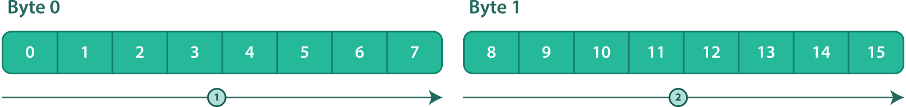

`"little-endian"`:: {empty}
+
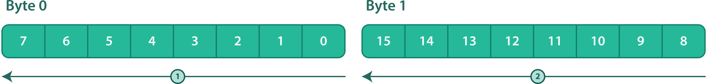

.Contiguous {fl-ba} fields: big-endian versus little-endian.
====
This example shows the binary layout of contiguous big-endian and
little-endian {fl-ba} fields.

Assume that {var-dec-o-minus-po}{nbsp}={nbsp}16. All the {fl-ba}
fields of this example have an implicit 1-bit <<align-dec,aligment
requirement>>.

Considering the following <<struct-member-cls,member classes>> of some
{struct-fc}:

[source,json]
----
[
  {
    "name": "green",
    "field-class": {
      "type": "fixed-length-bit-array",
      "length": 3,
      "byte-order": "big-endian"
    }
  },
  {
    "name": "blue",
    "field-class": {
      "type": "fixed-length-bit-array",
      "length": 9,
      "byte-order": "big-endian"
    }
  },
  {
    "name": "yellow",
    "field-class": {
      "type": "fixed-length-bit-array",
      "length": 14,
      "byte-order": "big-endian"
    }
  },
  {
    "name": "red",
    "field-class": {
      "type": "fixed-length-bit-array",
      "length": 4,
      "byte-order": "big-endian"
    }
  }
]
----

The binary layout is as such:

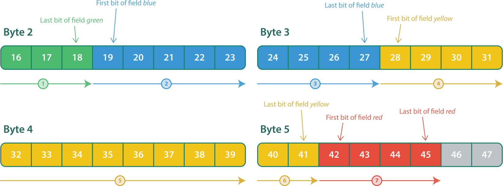

Considering the following member classes of some structure field class,
the only difference with the previous sample being the values of the
`byte-order` property:

[source,json]
----
[
  {
    "name": "green",
    "field-class": {
      "type": "fixed-length-bit-array",
      "length": 3,
      "byte-order": "little-endian"
    }
  },
  {
    "name": "blue",
    "field-class": {
      "type": "fixed-length-bit-array",
      "length": 9,
      "byte-order": "little-endian"
    }
  },
  {
    "name": "yellow",
    "field-class": {
      "type": "fixed-length-bit-array",
      "length": 14,
      "byte-order": "little-endian"
    }
  },
  {
    "name": "red",
    "field-class": {
      "type": "fixed-length-bit-array",
      "length": 4,
      "byte-order": "little-endian"
    }
  }
]
----

The binary layout is as such:

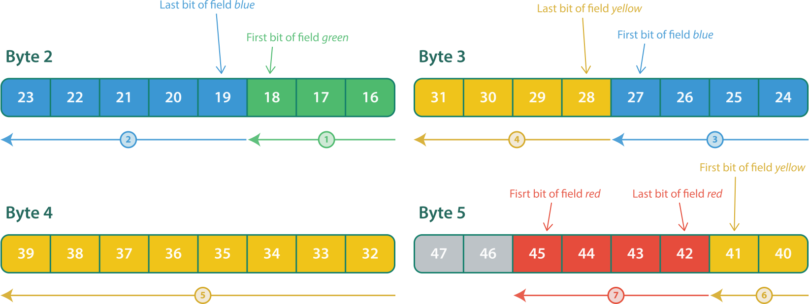
====

.Padding between {fl-ba} fields.
====
This example shows how the <<align-dec,alignment requirement>> of a
{fl-ba} field can translate into padding bits to skip during the
decoding process.

Assume that {var-dec-o-minus-po}{nbsp}={nbsp}32.

Considering the following <<struct-member-cls,member classes>> of some
{struct-fc}:

[source,json]
----
[
  {
    "name": "green",
    "field-class": {
      "type": "fixed-length-bit-array",
      "length": 5,
      "byte-order": "big-endian"
    }
  },
  {
    "name": "blue",
    "field-class": {
      "type": "fixed-length-bit-array",
      "length": 3,
      "byte-order": "big-endian",
      "alignment": 8
    }
  },
  {
    "name": "yellow",
    "field-class": {
      "type": "fixed-length-bit-array",
      "length": 4,
      "byte-order": "big-endian",
      "alignment": 4
    }
  }
]
----

The binary layout is as such:

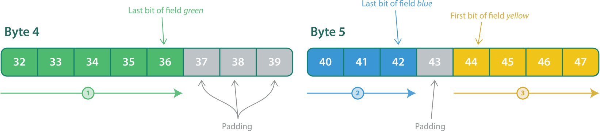

Considering the following member classes of some structure field class,
the only difference with the previous sample being the values of the
`byte-order` property:

[source,json]
----
[
  {
    "name": "green",
    "field-class": {
      "type": "fixed-length-bit-array",
      "length": 5,
      "byte-order": "little-endian"
    }
  },
  {
    "name": "blue",
    "field-class": {
      "type": "fixed-length-bit-array",
      "length": 3,
      "byte-order": "little-endian",
      "alignment": 8
    }
  },
  {
    "name": "yellow",
    "field-class": {
      "type": "fixed-length-bit-array",
      "length": 4,
      "byte-order": "little-endian",
      "alignment": 4
    }
  }
]
----

The binary layout is as such:

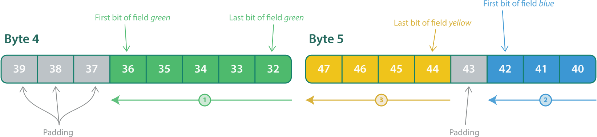
====

.Contiguous {fl-ba} fields with different byte orders.
====
<<fl-ba-field-dec-step-3,Step{nbsp}3>> of the decoding procedure above
requires that a <<consumer-def,consumer>> stops the data stream decoding
process if the byte order between two contiguous {fl-ba} fields changes
when{nbsp}{var-dec-o-minus-po} is not a mutliple of{nbsp}8.

In other words, a given data stream <<byte-def,byte>> {must-not} contain
bits of two {fl-ba} fields having different byte orders.

This example shows how contiguous {fl-ba} fields may have different byte
orders with correct <<align-dec,alignment>>.

Assume that {var-dec-o-minus-po}{nbsp}={nbsp}16.

Considering the following <<struct-member-cls,member classes>> of some
{struct-fc}:

[source,json]
----
[
  {
    "name": "green",
    "field-class": {
      "type": "fixed-length-bit-array",
      "length": 3,
      "byte-order": "big-endian"
    }
  },
  {
    "name": "blue",
    "field-class": {
      "type": "fixed-length-bit-array",
      "length": 5,
      "byte-order": "big-endian"
    }
  },
  {
    "name": "yellow",
    "field-class": {
      "type": "fixed-length-bit-array",
      "length": 5,
      "byte-order": "little-endian"
    }
  },
  {
    "name": "orange",
    "field-class": {
      "type": "fixed-length-bit-array",
      "length": 8,
      "byte-order": "little-endian"
    }
  },
  {
    "name": "red",
    "field-class": {
      "type": "fixed-length-bit-array",
      "length": 6,
      "byte-order": "big-endian",
      "alignment": 8
    }
  }
]
----

The binary layout is as such:

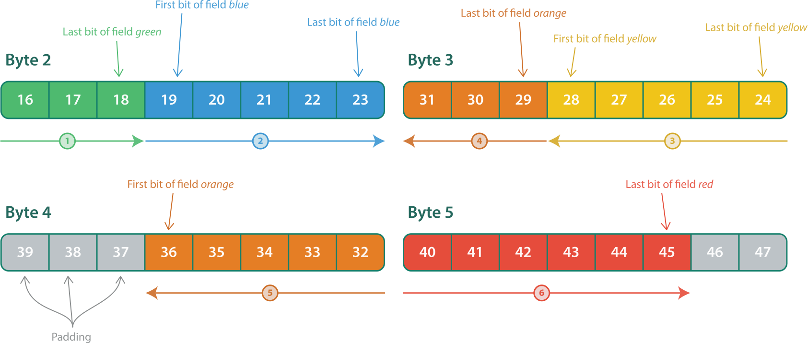
====

[[fl-bool-field-dec]]
==== {c-fl-bool} field decoding procedure

To decode an instance of a {fl-bool-fc}:

. Let __**VB**__ be a boolean.
. <<fl-ba-field-dec,Decode the instance as a {fl-ba} field>>.
. If all the elements of{nbsp}{var-v} are _false_, then set{nbsp}__**VB**__
  to _false_.
+
Else, set __**VB**__ to _true_.

_**VB**_ is the decoded boolean value.

[[fl-uint-field-dec]]
==== {c-fl-uint} field decoding procedure

To decode an instance of a {fl-uint-fc}:

. Let __**VI**__ be an unsigned integer.
. <<fl-ba-field-dec,Decode the instance as a {fl-ba} field>>.
. Set __**VI**__ as the unsigned integer interpretation
of{nbsp}{var-v}, where the first element of{nbsp}{var-v} is the most
significant bit.

_**VI**_ is the decoded unsigned integer value.

[[fl-sint-field-dec]]
==== {c-fl-sint} field decoding procedure

To decode an instance of a {fl-sint-fc}:

. Let __**VI**__ be a signed integer.
. <<fl-ba-field-dec,Decode the instance as a {fl-ba} field>>.
. Set __**VI**__ as the signed integer interpretation, following the
  two's complement format, of{nbsp}{var-v}, where the first element
  of{nbsp}{var-v} is the most significant bit.

_**VI**_ is the decoded signed integer value.

[[fl-fp-field-dec]]
==== {c-fl-fp} field decoding procedure

To decode an instance of a {fl-fp-fc}:

. Let __**VR**__ be a real value.
. <<fl-ba-field-dec,Decode the instance as a {fl-ba} field>>.
. Set __**VR**__ to the real number interpretation, following the
  {ieee754}, of{nbsp}{var-v}, where the first element of{nbsp}{var-v} is
  the most significant bit.

_**VR**_ is the decoded real value.

[[vl-ba-field-dec]]
==== {c-vl-ba} field decoding procedure

To decode an instance of a {vl-ba-fc}{nbsp}{var-f}:

. Let {var-v} be an empty array of booleans.

. <<align-dec,Align {var-dec-o-minus-po}>> according
  to{nbsp}{var-f}.

. Read __**N**__{nbsp}bytes of data from{nbsp}{var-s} at the
  offset{nbsp}{var-dec-o}, as many as needed following the unsigned
  https://en.wikipedia.org/wiki/LEB128[LEB128] format, appending the
  decoded bits to{nbsp}{var-v} as booleans from the most
  significant to the least significant.

. Set {var-dec-o} to {var-dec-o}{nbsp}pass:[+]{nbsp}__**N**__{nbsp}{times}{nbsp}8.

{var-v} is the decoded value.

.3-byte {vl-ba} field decoding.
====
Consider the following {vl-ba-fc}{nbsp}{var-f}:

[source,json]
----
{
  "type": "variable-length-bit-array"
}
----

The following diagram shows the three bytes of an instance
of{nbsp}{var-f} and the resulting bit array value.

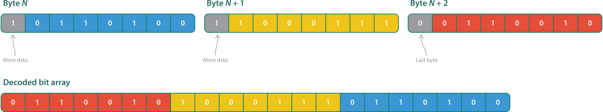

Note that the data bits of the last byte (in red) become the first
elements of the resulting bit array value because LEB128 is a
little-endian encoding.
====

[[vl-uint-field-dec]]
==== {c-vl-uint} field decoding procedure

To decode an instance of a {vl-uint-fc}:

. Let __**VI**__ be an unsigned integer.
. <<vl-ba-field-dec,Decode the instance as a {vl-ba} field>>.
. Set __**VI**__ as the unsigned integer interpretation of{nbsp}{var-v},
  where the first element of{nbsp}{var-v} is the most significant bit.

_**VI**_ is the decoded unsigned integer value.

[[vl-sint-field-dec]]
==== {c-vl-sint} field decoding procedure

To decode an instance of a {vl-sint-fc}:

. Let __**VI**__ be a signed integer.
. <<vl-ba-field-dec,Decode the instance as a {vl-ba} field>>.
. Set __**VI**__ as the signed integer interpretation, following the
  two's complement format, of{nbsp}{var-v}, where the first element
  of{nbsp}{var-v} is the most significant bit.

_**VI**_ is the decoded signed integer value.

[[str-field-dec]]
==== {c-str} field decoding procedure

To decode an instance of a {str-fc}{nbsp}{var-f}:

. Let:
** _**B**_ be a byte.
** _**A**_ be an empty sequence of bytes.
** {var-v} be a string.

. <<align-dec,Align {var-dec-o-minus-po}>> according
  to{nbsp}{var-f}.

. Read one byte of data from{nbsp}{var-s} at the offset{nbsp}{var-dec-o}
  as{nbsp}__**B**__.

. Set {var-dec-o} to {var-dec-o}{nbsp}pass:[+]{nbsp}8.

. While __**B**__{nbsp}{noteq}{nbsp}0:
.. Append __**B**__ to{nbsp}__**A**__.
.. Read one byte of data from{nbsp}{var-s} at the
   offset{nbsp}{var-dec-o} as{nbsp}__**B**__.
.. Set {var-dec-o} to {var-dec-o}{nbsp}pass:[+]{nbsp}8.

. Decode _**A**_, following UTF-8, as {var-v}.

{var-v} is the decoded string value.

.22-byte {str} field decoding.
====
Consider the following {str-fc}{nbsp}{var-f}:

[source,json]
----
{
  "type": "null-terminated-string"
}
----

The following diagram shows <<pkt,packet>> bytes including a 22-byte
instance of{nbsp}{var-f} (in blue) and its resulting string value.

The offset of the {str} field, from the beginning of the packet,
is 0xfc23{nbsp}bytes, which means
{var-dec-o-minus-po}{nbsp}={nbsp}516,376.

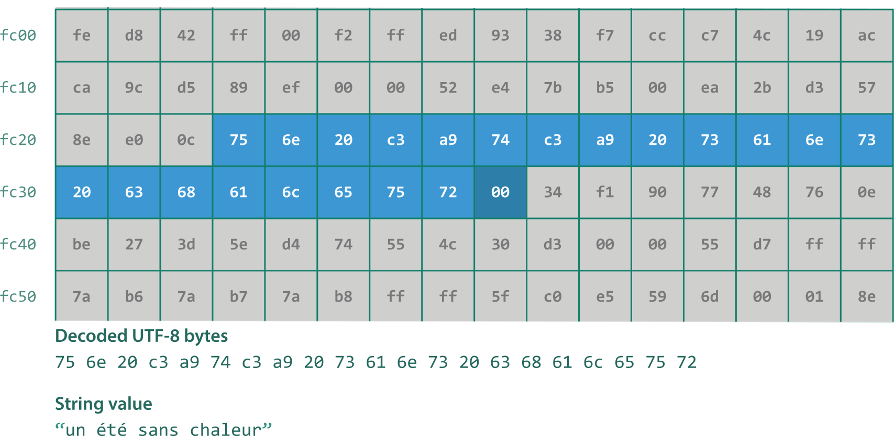

The field contains 21{nbsp}UTF-8 bytes and a null terminating byte.

The resulting string value contains 19{nbsp}Unicode characters.

After the field is decoded, {var-dec-o-minus-po}{nbsp}={nbsp}516,552.
====

[[sl-str-field-dec]]
==== {c-sl-str} field decoding procedure

To decode an instance of a {sl-str-fc}{nbsp}{var-f}:

. Let:
** _**L**_ be the `length` property of{nbsp}{var-f}.
** _**I**_ be an unsigned integer initialized to 0.
** _**B**_ be a byte.
** _**R**_ be a boolean initialized to _true_.
** _**A**_ be an empty sequence of bytes.
** {var-v} be a string.

. <<align-dec,Align {var-dec-o-minus-po}>> according
  to{nbsp}{var-f}.

. While __**I**__{nbsp}<{nbsp}__**L**__:

.. Read one byte of data from{nbsp}{var-s} at the
   offset{nbsp}{var-dec-o} as{nbsp}__**B**__.
.. If __**B**__{nbsp}={nbsp}0, then set _**R**_{nbsp}to _false_.
+
Else, if _**R**_ is _true_, then append{nbsp}__**B**__
to{nbsp}__**A**__.

.. Set {var-dec-o} to {var-dec-o}{nbsp}pass:[+]{nbsp}8.
.. Set _**I**_ to __**I**__{nbsp}pass:[+]{nbsp}1.

. Decode _**A**_, following UTF-8, as {var-v}.

{var-v} is the decoded string value.

.18-byte {sl-str} field decoding.
====
Consider the following {str-fc}{nbsp}{var-f}:

[source,json]
----
{
  "type": "static-length-string",
  "length": 18
}
----

The following diagram shows <<pkt,packet>> bytes including a 18-byte
instance of{nbsp}{var-f} (in green) and its resulting string value.

The offset of the {sl-str} field, from the beginning of the packet, is
0x8c46{nbsp}bytes, which means {var-dec-o-minus-po}{nbsp}={nbsp}287,280.

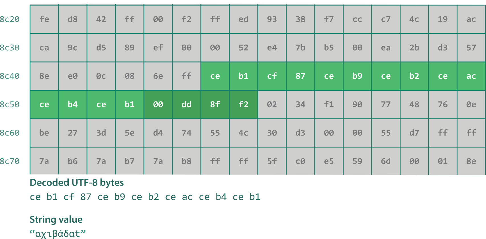

The field contains 14{nbsp}UTF-8 bytes, a null terminating byte,
and three garbage data bytes to ignore.

The resulting string value contains seven Unicode characters.

After the field is decoded, {var-dec-o-minus-po}{nbsp}={nbsp}287,424.
====

[[sl-blob-field-dec]]
==== {c-sl-blob} field decoding procedure

To decode an instance of a {sl-blob-fc}{nbsp}{var-f}:

. Let:
** _**L**_ be the `length` property of{nbsp}{var-f}.
** {var-v} be an array of bytes of length{nbsp}__**L**__.

. <<align-dec,Align {var-dec-o-minus-po}>> according
  to{nbsp}{var-f}.

. Read _**L**_ bytes of data from{nbsp}{var-s} at the
  offset{nbsp}{var-dec-o} as{nbsp}{var-v}.

. Set {var-dec-o} to {var-dec-o}{nbsp}pass:[+]{nbsp}__**L**__{nbsp}{times}{nbsp}8.

{var-v} is the decoded BLOB value.

[[dl-str-field-dec]]
==== {c-dl-str} field decoding procedure

To decode an instance of a {dl-str-fc}{nbsp}{var-f}:

. Let:
** _**L**_ be the value of the previously decoded unsigned integer
   field of which the `length-field-location` property of{nbsp}{var-f}
   indicates the <<field-loc,location>>.
** _**I**_ be an unsigned integer initialized to 0.
** _**B**_ be a byte.
** _**R**_ be a boolean initialized to _true_.
** _**A**_ be an empty sequence of bytes.
** {var-v} be a string.

. <<align-dec,Align {var-dec-o-minus-po}>> according
  to{nbsp}{var-f}.

. While __**I**__{nbsp}<{nbsp}__**L**__:

.. Read one byte of data from{nbsp}{var-s} at the
   offset{nbsp}{var-dec-o} as{nbsp}__**B**__.
.. If __**B**__{nbsp}={nbsp}0, then set _**R**_{nbsp}to _false_.
+
Else, if _**R**_ is _true_, then append{nbsp}__**B**__
to{nbsp}__**A**__.

.. Set {var-dec-o} to {var-dec-o}{nbsp}pass:[+]{nbsp}8.
.. Set _**I**_ to __**I**__{nbsp}pass:[+]{nbsp}1.

. Decode _**A**_, following UTF-8, as {var-v}.

{var-v} is the decoded string value.

[[dl-blob-field-dec]]
==== {c-dl-blob} field decoding procedure

To decode an instance of a {dl-blob-fc}{nbsp}{var-f}:

. Let:
** _**L**_ be the value of the previously decoded unsigned integer
   field of which the `length-field-location` property of{nbsp}{var-f}
   indicates the <<field-loc,location>>.
** {var-v} be an array of bytes of length{nbsp}__**L**__.

. <<align-dec,Align {var-dec-o-minus-po}>> according
  to{nbsp}{var-f}.

. Read _**L**_ bytes of data from{nbsp}{var-s} at the
  offset{nbsp}{var-dec-o} as{nbsp}{var-v}.

. Set {var-dec-o} to {var-dec-o}{nbsp}pass:[+]{nbsp}__**L**__{nbsp}{times}{nbsp}8.

{var-v} is the decoded BLOB value.

[[struct-field-dec]]
==== Structure field decoding procedure

To decode an instance of a {struct-fc}{nbsp}{var-f}:

. Let:
** _**M**_ be the `members` property of{nbsp}{var-f}.
** {var-v} be an empty structure.

. <<align-dec,Align {var-dec-o-minus-po}>> according
  to{nbsp}{var-f}.

. For each member class{nbsp}__**MC**__ of{nbsp}__**M**__:
.. Let:
*** _**MF**_ be the `field-class` property of{nbsp}__**MC**__.
*** _**MN**_ be the `name` property of{nbsp}__**MC**__.
.. <<field-dec,Decode>> one instance of{nbsp}__**MF**__, appending the
   resulting value as a member of{nbsp}{var-v} named{nbsp}__**MN**__.

{var-v} is the decoded value.

[[sl-array-field-dec]]
==== {c-sl-array} field decoding procedure

To decode an instance of a {sl-array-fc}{nbsp}{var-f}:

. Let:
** _**L**_ be the `length` property of{nbsp}{var-f}.
** _**EF**_ be the `element-field-class` property of{nbsp}{var-f}.
** _**I**_ be an unsigned integer initialized to 0.
** {var-v} be an array of values of length{nbsp}__**L**__.

. <<align-dec,Align {var-dec-o-minus-po}>> according
  to{nbsp}{var-f}.

. While __**I**__{nbsp}<{nbsp}__**L**__:
.. <<field-dec,Decode>> one instance of{nbsp}__**EF**__
   as element{nbsp}__**I**__ of{nbsp}{var-v}.
.. Set _**I**_ to __**I**__{nbsp}pass:[+]{nbsp}1.

{var-v} is the decoded value.

[[dl-array-field-dec]]
==== {c-dl-array} field decoding procedure

To decode an instance of a {dl-array-fc}{nbsp}{var-f}:

. Let:
** _**L**_ be the value of the previously decoded unsigned integer field
   of which the `length-field-location` property of{nbsp}{var-f}
   indicates the <<field-loc,location>>.
** _**EF**_ be the `element-field-class` property of{nbsp}{var-f}.
** _**I**_ be an unsigned integer initialized to 0.
** {var-v} be an array of values of length{nbsp}__**L**__

. <<align-dec,Align {var-dec-o-minus-po}>> according
  to{nbsp}{var-f}.

. While __**I**__{nbsp}<{nbsp}__**L**__:
.. <<field-dec,Decode>> one instance of{nbsp}__**EF**__
   as element{nbsp}__**I**__ of{nbsp}{var-v}.
.. Set _**I**_ to __**I**__{nbsp}pass:[+]{nbsp}1.

{var-v} is the decoded value.

.5-element {dl-array} field decoding.
====
Consider the following <<er-payload,event record payload>>
{struct-fc}{nbsp}{var-f}:

[source,json]
----
{
  "type": "structure",
  "members": [
    {
      "name": "len",
      "field-class": {
        "type": "fixed-length-unsigned-integer",
        "length": 16,
        "byte-order": "big-endian"
      }
    },
    {
      "name": "id",
      "field-class": {
        "type": "null-terminated-string"
      }
    },
    {
      "name": "vals",
      "field-class": {
        "type":
        "type": "dynamic-length-array",
        "length-field-location": ["event-record-payload", "len"],
        "element-field-class": {
          "type": "fixed-length-unsigned-integer",
          "length": 32,
          "byte-order": "little-endian",
          "alignment": 32
        }
      }
    }
  ]
}
----

The following diagram shows <<pkt,packet>> bytes including an instance
of{nbsp}{var-f} (starting in green and ending in blue) and the resulting
signed integer values of its `vals` member.

The offset of the `len` {fl-uint} field, from the beginning of the packet, is
0x42c1{nbsp}bytes, which means {var-dec-o-minus-po}{nbsp}={nbsp}136,712.

The offset of the `vals` {dl-array} field, from the beginning of the
packet, is 0x42c8{nbsp}bytes, which means
{var-dec-o-minus-po}{nbsp}={nbsp}136,768.

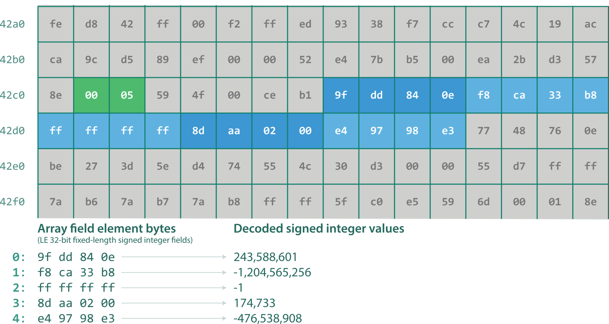

The unsigned integer value of the `len` field is{nbsp}5, which means the
`vals` field contains five {fl-sint} fields.

After the structure field is decoded,
{var-dec-o-minus-po}{nbsp}={nbsp}136,928.
====

[[opt-field-dec]]
==== Optional field decoding procedure

To decode an instance of an {opt-fc}{nbsp}{var-f}:

. Let:
** _**SEL**_ be the value of the previously decoded <<bool-fc,boolean>>
   or <<int-fc,integer>> field of which the `selector-field-location`
   property of{nbsp}{var-f} indicates the <<field-loc,location>>.
** _**OF**_ be the `field-class` property of {var-f}.
** {var-v} be an optional value, initially not set.

. If the class of{nbsp}__**SEL**__ is a {fl-bool-fc}
  and _**SEL**_ is _true_, then:
** <<field-dec,Decode>> one instance of{nbsp}__**OF**__
   as{nbsp}{var-v}.

+
Else, if _**SEL**_ is an element of any <<int-range-set,integer range>>
of the `selector-field-ranges` property of{nbsp}{var-f}, then:
** <<field-dec,Decode>> one instance of{nbsp}__**OF**__
   as{nbsp}{var-v}.

If {var-v} is set, then {var-v} is the decoded value. Otherwise, there's
no decoded value (the optional field is disabled).

[[var-field-dec]]
==== Variant field decoding procedure

To decode an instance of an {var-fc}{nbsp}{var-f}:

. Let:
** _**SEL**_ be the value of the previously decoded <<int-fc,integer>>
   field of which the `selector-field-location` property of{nbsp}{var-f}
   indicates the <<field-loc,location>>.
** _**OPTS**_ be the `options` property of{nbsp}{var-f}.
** _**OF**_ be the `field-class` property of the <<var-fc-opt,variant
   field class option>>{nbsp}__**OPT**__ of{nbsp}__**OPTS**__ of
   which{nbsp}__**SEL**__ is an element of any <<int-range-set,integer
   range>> of the `selector-field-ranges` property of{nbsp}__**OPT**__.
** {var-v} be a value.

. <<field-dec,Decode>> one instance of{nbsp}__**OF**__
  as{nbsp}{var-v}.

{var-v} is the decoded value.
